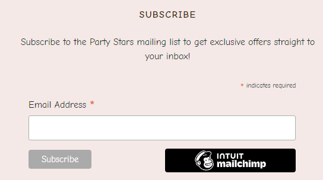

<h1 align="center">Party Stars</h1>

You can find live site [here](https://partystars-pp5-c4bccd7a3f65.herokuapp.com/)

## Overview
Welcome to Party Stars.
Party Stars is a full stack, E-commerce project built using Django, Python, HTML, CSS and JavaScript for Code Institute P5 E-commerce Applications. This website is a B2C e-commerce application that allows users to purchase premium party products to a growing and diverse target audience.

 

# Table of Contents

1. [UX](#ux)
2. [Strategy](#the-strategy)
    * [Targeted Users](#targeted-users)
    * [Site Goals](#site-goals)
    * [Project Goals](#project-goals)
3. [Agile Planning](#agile-planning)
    * [User Stories](#user-stories)
4. [Skeleton Plane](#skeleton-plane)
    * [Wireframes](#wireframes)
    * [Database Schema](#database-schema) 
5. [Structure](#structure)
6. [The Structure Plane](#the-structure-plane)
    * [Features](#features)
    * [Home Page](#home-page)
      * [Brands Section](#brands-section)
      * [Categories Section](#categories-section)
      * [Featured Products Section](#featured-products-section)
      * [Why Shop With Us Section](#why-shop-with-us-section)
      * [Footer](#footer)
    * [FAQs Page](#faqs-page)
    * [Contact Page](#contact-page)
    * [Pages Restricted to Login](#restricted-pages)
    * [Products](#products-page)
    * [Product Details](#product-details-page)
    * [Wishlist](#wishlist)
    * [My Profile](#profile-page)
    * [Cart Page](#cart-page)
    * [Checkout Page](#checkout-page)
    * [Admin Page](#admin-page)
    * [Future Features](#future-features)
7. [The Surface Plane](#the-surface-plane)
    * [Design](#design)
      * [Colour Scheme](#colour-scheme)
      * [Typography](#typography)
      * [Images](#images)
8. [Business Model](#business-model)
    * [Marketing Strategy](#marketing-strategy)
      * [Social Media Marketing](#social-media-marketing)
      * [Newsletter Marketing](#newsletter-marketing)
    * [SEO](#search-engine-optimization-seo)
      * [Keywords](#keywords)
      * [SiteMap](#sitemapxml)
      * [Robots](#robotstxt)
9. [Technologies](#technologies)
    * [Languages Used](#languages-used)
    * [Libraries And Frameworks](#libraries-and-frameworks)
    * [Tools and Resources](#tools-and-resources)
10. [Testing](#testing)

 

# UX

## Strategy

### Targeted Audience

- A user that wants to view and buy party products.
- A user that wants to see the latest party and diferent events decoration.

### Site Goals

- For users to be able to search products quickly and easily.
- For users to be able to purchase products quickly and easily.
- For users to be able to create an account to store their Wishlist and see their order history.
- For users to be able to edit their saved address for easier purchasing.
- For users to be able to contact the business online.

### Project Goals

- Create a fully working e-commerce application that would look and feel like a professionally designed online store. 
- The website will an intuitive navigation and conformability of use.

 

[Back to Top](#table-of-contents)

 

## **Agile Planning**

Party Stars was developed with agile planning. This meant that each individual feature was split first into User Stories for what the user of the website would expect. Each User Story was thought about and planned out, which allowed me to create multiple tasks which would be developed to implement certain features and these Tasks were then grouped together into Epics.

Everything was labeled as Must Have, Should Have and Could Have to help prioritise which were most important to implement.

The Project board can be found [here](https://github.com/users/ionelaSabinaMacovei/projects/4).

 

## User Stories

**Epic: Admin/Store Owner**

| ID  | Content                                                                                                                                                   |
| --- | --------------------------------------------------------------------------------------------------------------------------------------------------------- |
| 1   | As a **store owner** I can log in so that I have full access to the store backend                                                                         |
| 2   | As a **store owner** I can add new product to the shop so that I can make sure the website is up to date                                                  |
| 3   | As a **store owner** I can add new categories to the shop so that I can make sure the website is up to date                                               |
| 4   | As a **store owner** I can add FAQ's to the site so that I can make sure that the user can find answer on the page before contacting the customer         |service                                                                                                                                                           |
| 5   | As a **store owner** I can edit/delete products so that I can make sure the website is up to date                                                         |
| 6   | As a **store owner** I can edit/delete categories so that I can make sure the website is up to date                                                       |
| 7   | As a **store owner** I can edit/delete questions so that I can provide users with information about common questions and concerns                                                                                                                                                          |
| 8   | As a **store owner** I can send out a newsletter via email so that I keep customers updated with new products                                                |
| 9   | As a **store owner**  I can add products to a sale list, with calculated discount so that the user can obatin a bonus when buying from store                                                                 |
| 10  | As a **store owner** I can read and respond to users questions send by contact form                                                                       |

**Epic: Navigation**

| ID  | Content                                                                                                                      |
| --- | ---------------------------------------------------------------------------------------------------------------------------- |
| 11  | As a **user** I can see an interesting home page so that I can understand what shop sells                                    |
| 12  | As a **user** I can easily navigate through the site so that I can view desired content                                      |
| 13  | As a **user** I can easily find a navigation bar and footer so that I can see what content there is on the website           |
| 14  | Aa a **user** I can easily see the products list so that I can see what the store has to offer                               |
| 15  | As a **user** I can search products by category so that I can easily find what I'm looking for                               |
| 16  | As a **user** I can sort products by rating, price and name so that I can easily find what I'm looking for                   |
| 17  | As a **user** I can search for products using the search form so that I can find the products I'm specifically looking for   |
| 18  | As a **user** I can see the book details page so that I can prodcut name, rating, price, short description and reviews  |
| 19  | As a **user** I can read the FAQ's so that I can find the answer to my question or concern before contacting the store   |

**Epic: Purchase**
| ID | Content |
| --- | ----------- |
| 20 | As a **user** I can select the quantity of the desired product so that I can buy more product of the same kind
| 21 | As a **user** I can add a selected product into the shopping bag so that I can keep track of what I am spending
| 22 | As a **user** I can see the shopping bag summary and total cost so that I can see how much I will spend
| 23 | As a **user** I can remove items from shopping bag so that I don't buy what I don't want
| 24 | As a **user** I can put in my card details so that I can pay for my goods
| 25 | As a **user** I receive order confirmations so that I can be sure my order has been processed
| 26 | As a **user** I can select the quantity of the desired product so that I can buy more product of the same kind
| 27 | As a **user** I can easily view deals and sales so that I can take advantage of savings on products I want to purchase
| 28 | As a **user** I can see my carbon footprint in the shooping bag so that I know if I would go furhet with my products

**Epic: User Interaction**

| ID  | Content                                                                                                                                |
| --- | -------------------------------------------------------------------------------------------------------------------------------------- |
| 29  | As a **user** I can see rating and reviews so that I can read the opinions of other users                                              |
| 30  | As a **user** I am notified about any changes I have made so that I have a clear understanding of what has been completed/updated      |
| 31  | As a **user** I can connect to the social media sites so that I can follow them and keep up to date with their products and promotions |
| 30  | As a **user** I can sign up for the website's newsletter so that I can keep up to date with new products and promotions                |
| 31  | As a **user** I can contact the store so that I can find out any information that I require                                            |
| 32  | As a **logged-in User** I can leave reating and reviews so that I can share my experience with others                                  |

**Epic: Accounts**

| ID  | Content                                                                                                                  |
| --- | ------------------------------------------------------------------------------------------------------------------------ |
| 33  | As a **user** I can easily see if I'm logged-in or logged-out so that I can be sure what my status is                    |
| 34  | As a **user** I can log in/out off my account if I wish so that I can connect or disconnect from the website             |
| 35  | As a **user** I can register for an account so that I can use features for logged-in users                               |
| 36  | As a **user** I can receive a confirmation email when creating an account so that I know the registration was successful |
| 37  | As a **logged-in User** I can have my details saved so that I don't have to retype my address every time                 |
| 38  | As a **logged-in User** I can add selected products to my whishlist so that I can save them for later purchase           |

**Epic: Developer Task**

| ID  | Content                                                                                                                  |
| --- | ------------------------------------------------------------------------------------------------------------------------ |
| 39  | Install Django so that a project can be created                                                                          |
| 40  | Install Django AllAuth                                                                                                   |
| 41  | Create a Heroku app and connect it to the django project.                                                                |
| 42  | Implement stripe payment system API within the project                                                                   |
| 43  | Connetc AWS storage for static files and images                                                                          |
| 44  | Set up the mailchimp for subracribe and newletters.                                                                      |

[Back to Top](#table-of-contents)

 

## Skeleton Plane

### Wireframes

# Wireframes

All wireframes were created used [Balsamiq](https://balsamiq.com/)

Wireframes:

- [Home Page](assets/wireframes/home-page1.png)
- [Product List](assets/wireframes/products-page.png)
- [Product Details](assets/wireframes/product-details-page.png)
- [Product Details 1 ](assets/wireframes/product-details1-page.png)
- [Shopping Bag](assets/wireframes/shopping-bag-page.png)
- [Checkout](assets/wireframes/checkout-page.png)

 

### Database Schema

[Back to Top](#table-of-contents)

 

### Structure

- The structure idea for Party Stars was to keep it simple. Simplicity helps users to quickly and easily access the app and navigate within the app.
- Home page with an carousel that immediately tells the user what the site is for.
- Account registration which will allow for restricted viewing on Editing and Deleting reviews, wishlists and saving their information for quicker checkout next time.
- Fully responsive website, tested across all screen sizes, with navigation for mobile.

The website is made from 8 apps:

- Products
- Checkout
- Home
- Profiles
- Questions
- Bag
- Wishlist

 

[Back to Top](#table-of-contents)

 

## The Structure Plane

# Features 

## Existing Features

### Home Page

- The home page features a carousel, with some text that show a product for sale. This lets the user know immediately what type of items are available.
- The index page is split into multiple sections, with the information easy to read and eye catching to a visitor.
- There is a button that links to the product details page.

 

[Back to Top](#table-of-contents)

 

### Navigation bar

- The navigation bar appears on every page so users can easily navigate through the site
- Navigation bar has links for 'Home', 'All Products', 'Categories', 'Special Offers and icons for search bar, account and shopping bag, also if the user is loged in the heart icon for wishlist will apear on the navbar.
- The Login/Register feature is located in the upper right corner and offers the user to log in or register for an account as well as log out of the site
- When the user is logged in links for 'Login' and 'Register' will change to 'My Profile', 'Logout'
- The admin user has extra access that allow them to add, update and remove products, category and faq's from the store
- The shopping bag is also situated on the top right corner of the site and it is always visible for the user throughout all the pages. With one click they can access their shopping bag to see what is in there, update the quantities of book they wish to purchase or to delete them from the shopping bag
- The navbar contain a banner with the information about delivery
- The navbar is fully responsive, collapsing into a hamburger menu for medium and small screen size

### Footer

- The footer is used across all pages, with links to Home, Contact, FAQs, Privacy Policies, Shpping Info and About us.
- The footer also has our newsletter signup, generated through MailChimp. This makes it available across every page to maximise the chance of someone signing up.

 

[Back to Top](#table-of-contents)

 

### Products Page

- The Products Page lists all products initially.
- This can be changed by choosing a category from the drop down navbar menu.
- Clicking on the title or image will bring the user to the product detail page for that item.

 

[Back to Top](#table-of-contents)

 

### Product Details Page

- The product detail page shows a larger product image, a description for the product, category tag, rating stars, wishlist tag wich allows users to add items to wish list, a quantity selector and, as well as allowing the user to add this product to their cart.
- The page also shows user left reviews, with the option for logged in users to leave their own.
- Reviews are able to be updated or deleted by the User who left them or by admin/superusers. This is all CRUD functionality.

 

[Back to Top](#table-of-contents)

 

### Categories Section

- Categories dropdown from Navbar, allowing the user to access specific categories
- Categories page it is using the same format as the product list.

- Categories:
  - Baby
  - Birthday Party
  - Kids Party
  - Milestone Birthday
  - Season & Events
  - Wedding

### **Special Offers**

- Special Offers dropdown from Navbar, allowing the user to access specific offer
- From the dropdown menu user can select :
    - Sale
    - New arrivals

 

[Back to Top](#table-of-contents)

 

### Contact Page

- The contact page features small icons with quick and easy to read information with a phone number, address and email.
- The page also hold a form for users to get in contact with the business. When the user submit the form an email will be sent to the admin and another one for the user and bouth of them will be notified. 

### FAQs Page

- The FAQs page gives the user information about shipping, helium, cupon code and payment options.
 

[Back to Top](#table-of-contents)

 

### Wishlist Page

- The Wishlist page allows users to have a list of all the products they have added to their Wishlist, by clicking the heart icon on each product.
- On the Wishlist page, there is a short summary of the product, as well as a link to the product detail page, which allows users to add it to their cart.
- The page also has a view and remove option, which allows users to remove product from their Wishlist - again this is done through CRUD functionality.

 

[Back to Top](#table-of-contents)

 

### About Us

- About Us modal present our mission and our eco journey

 

[Back to Top](#table-of-contents)

 

### Shipping Info

- Shiping info modal contain information about our shipping policy.

 

[Back to Top](#table-of-contents)

 

### Privacy Policies

- Privacy Policies modal contain information about our privacy policy.

 

[Back to Top](#table-of-contents)

 

### Shopping Bag Page

- The Shopping bag page shows everything a user has in their bag currently.
- This page allows for updating quantities, deleting products from their bag and seeing details of each product.
- The subtotals are calculated automatically and if a product is on sale, it will show the original price of each item and the sale price.

 

[Back to Top](#table-of-contents)

 

### Checkout Page

- The checkout page shows the products, prices, a coupon section, includes a users information and a stripe element for secure card payments.
- The coupon code section allows a user to add a coupon code, which then shows how much of a discount the user will get, as well as their newly updated total price.
- On successful checkout, an order summary page is shown. This will include the discount if a coupon was used, and has a link to brows more products after. Also the user will recive an email with the order confirmation.

 

[Back to Top](#table-of-contents)

 

### User Profile

- A logged-in user can access the My Profile link, this page displayed links to personal details, previous orders and wishlist
- The personal details page is where the user can update their default shipping/billing address, change email address and password
- The previous order displays a list of all the orders previously made by the user
- Wishlist displays the list of items the user has saved to their wishlist, with the ability to remove the product

 

[Back to Top](#table-of-contents)

 

### **Admin**

- Admin can preform full CRUD functionalliy without having to enter the default 'admin panel' from django
- Admin can add products from 'Product Managment' link in the account menu from the navigation bar
- Admin can add category from 'Product Managment' link
- Admin can add FAQ's from 'FAQ's' link
- Admin can add coupon from 'Coupon's' link
- Admin can edit/delete product from all product page and product details page
- Admin can edit/delete category from 'Category Management' link
- Admin can edit/delete FAQ from 'FAQ Managemnt' and FAQ's page, mark them as published or draft
- Admin can edit/delete FAQ from 'Coupon Managment' and Coupon page, mark them as active

 

[Back to Top](#table-of-contents)

 

## Future Features

- Stock app
- Currently, the coupons can be added any number of times - there is no limit for one use per customer. I tried to implement that to no success.
- Carbon Footprint

## The Surface Plane
## Design
### Colour Scheme
 -  The colour scheme was designed so that while it stands out as a bright interface, the colours also don't distract from the product images, as these are the main point of the website.

### Typography
 -   The font chosen for the website is a font called Comic Neue. This was picked because it is very easy to read with a medium contrast but it also has a somewhat fantasy feel to it. I wanted the typography to compliment the website, not overpower what it was saying. The font was found on [Google Font](https://fonts.googleapis.com/css2?family=Comic+Neue:wght@400;700&display=swap) and imported to the website with a CSS import.

 

[Back to Top](#table-of-contents)

 

## **Business Model**

This website follows a Business to Customer model - it sells party products  directly to the customer. The website has been built for quick checkout users, with extra features available to users who have signed up to the website, as well as users who subscribe to the newsletter.

[Back to Top](#table-of-contents)

## **Marketing Strategy**

### **Social Media Marketing**

A Facebook page is included. The main goal of this Facebook page would be to showcase new deals on products, give coupon code discounts to followers.

### **Newsletter Marketing**

The website has an embedded [Mailchimp](https://mailchimp.com/?currency=EUR) newsletter in the footer with a message that inform user if they subscribe they will recive an coupon code. The campaign sends out a custom thank you email with a discount code to encourage users to subscribe.

This newsletter can in turn be used by the site owner to send subscribers emails on the latest products, deals, and discounts available.

[Back to Top](#table-of-contents)

## **Search Engine Optimization (SEO)**

- I have created a sitemap.xml and robots.txt file to help aid search engines locate the site. To keep user's information safe, any pages that could contain sensitive information has been disallowed in the robots.txt.

[Back to top](#table-of-contents)

 

# Technologies

## Languages Used
* [HTML5](https://en.wikipedia.org/wiki/HTML5)
* [CSS3](https://en.wikipedia.org/wiki/Cascading_Style_Sheets)
* [Javascript](https://en.wikipedia.org/wiki/JavaScript)
* [Python](https://en.wikipedia.org/wiki/Python_(programming_language))

## Frameworks Used

* [Django](https://www.djangoproject.com/)
* [Bootstrap](https://blog.getbootstrap.com/) 

## Libraries And Installed Packages

* [crispy-bootstrap4](https://pypi.org/project/crispy-bootstrap4/) - Template pack used for django-crispy-forms
* [django-crispy-forms](https://pypi.org/project/crispy-bootstrap4/) - Used to render forms throughout the project.
* [dj-database-url](https://pypi.org/project/dj-database-url/) - A package used to utilize DATABASE_URL environment variable. 
* [django-allauth](https://django-allauth.readthedocs.io/en/latest/) - Allows authentication, registration and account management in Django.
* [django-countries, v7.2.1](https://pypi.org/project/django-countries/7.2.1/) - Django application used to provide country choices for use with forms, and a country field for models.
* [gunicorn](https://gunicorn.org/) - A Python WSGI HTTP Server for UNIX.
* [psycopg2](https://pypi.org/project/psycopg2/) - A PostgreSQL database adapter.
* [boto3==1.26.27](https://pypi.org/project/boto3/) - An Amazon Web Services (AWS) software development kit (SDK) used to connect to the S3 bucket
* [django storages](https://django-storages.readthedocs.io/en/latest/) - Collection of custom storage backends for Django.
* [Css Minifier](https://www.toptal.com/developers/cssminifier) - Minify CSS for better response time.

 

[Back to Top](#table-of-contents)

 

## Tools And Resources
* [GitPod](https://www.gitpod.io/)
* [GitHub](https://github.com/)
* [Heroku](https://heroku.com)
* [ElephantSQL](https://www.elephantsql.com/)
* [ReadMe Template](https://github.com/Code-Institute-Solutions/readme-template)
* [Stack Overflow](https://stackoverflow.com/)
* [Coolors](https://coolors.co/)
* [AmIResponsive](https://ui.dev/amiresponsive)
* [AWS](https://aws.amazon.com/) – was used to store static files 
* [Google Fonts](https://fonts.google.com/https://fonts.google.com/) - provide fonts for the website.
* [Font Awesome](https://fontawesome.com/) -was used for icons.
* [Balsamiq](https://balsamiq.com/) - was used to create site wireframes.

## Extensions 

[Boto3](https://boto3.amazonaws.com/v1/documentation/api/latest/index.html) - was used to to create, configure, and manage AWS services

[Pillow](https://pillow.readthedocs.io/en/stable/) - This library provides extensive file format support, an efficient internal representation, and fairly powerful image processing capabilities.

[Stripe](https://stripe.com/docs) - was used to make and process payments

 

[Back to Top](#table-of-contents)

 
