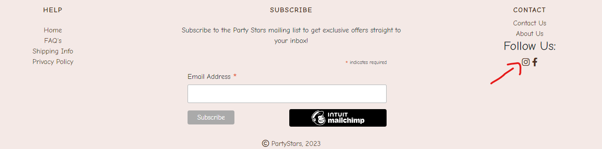

<h1 align="center">Party Stars</h1>


<p align="center">

</p>

You can find live site [here](https://partystars-pp5-c4bccd7a3f65.herokuapp.com/)

## Overview
Welcome to Party Stars.
Party Stars is a full stack, E-commerce project built using Django, Python, HTML, CSS and JavaScript for Code Institute P5 E-commerce Applications. This website is a B2C e-commerce application that allows users to purchase premium party products to a growing and diverse target audience.


<br>

# Table of Contents

1. [UX](#ux)
2. [Strategy](#the-strategy)
    * [Targeted Audience](#targeted-audience)
    * [Site Goals](#site-goals)
    * [Project Goals](#project-goals)
3. [Agile Planning](#agile-planning)
    * [User Stories](#user-stories)
4. [Skeleton Plane](#skeleton-plane)
    * [Wireframes](#wireframes)
    * [Database Schema](#database-schema) 
5. [Structure](#structure)
6. [The Structure Plane](#the-structure-plane)
    * [Features](#features)
    * [Future Features](#future-features)
7. [The Surface Plane](#the-surface-plane)
    * [Design](#design)
      * [Colour Scheme](#colour-scheme)
      * [Typography](#typography)
8. [Business Model](#business-model)
    * [Marketing Strategy](#marketing-strategy)
      * [Social Media Marketing](#social-media-marketing)
      * [Newsletter Marketing](#newsletter-marketing)
    * [SEO](#search-engine-optimization-seo)
9. [Technologies](#technologies)
    * [Languages Used](#languages-used)
    * [Libraries And Frameworks](#libraries-and-frameworks)
    * [Tools and Resources](#tools-and-resources)
    * [Extensions](#extensions )
10. [Testing](#testing)
11. [Deployment](#deployment)
12. [Credits and Sources](#credits-and-sources)


<br>


# UX

## Strategy

### Targeted Audience

- A user that wants to view and buy party products.
- A user that wants to see the latest party and diferent events decoration.

### Site Goals

- For users to be able to search products quickly and easily.
- For users to be able to purchase products quickly and easily.
- For users to be able to create an account to store their Wishlist and see their order history.
- For users to be able to edit their saved address for easier purchasing.
- For users to be able to contact the business online.

### Project Goals

- Create a fully working e-commerce application that would look and feel like a professionally designed online store. 
- The website will provide users with an enjoyable, intuitive and easy to use interface.

<br>

[Back to Top](#table-of-contents)

<br>

## **Agile Planning**

Party Stars was developed with agile planning. This meant that each individual feature was split first into User Stories for what the user of the website would expect. Each User Story was thought about and planned out, which allowed me to create multiple tasks which would be developed to implement certain features and these Tasks were then grouped together into Epics.

Everything was labeled as Must Have, Should Have and Could Have to help prioritise which were most important to implement.

The Project board can be found [here](https://github.com/users/ionelaSabinaMacovei/projects/4).

<br>

## User Stories


**Epic: Admin/Store Owner**

| ID  | Content                                                                                                                                                   |
| --- | --------------------------------------------------------------------------------------------------------------------------------------------------------- |
| 1   | As a **store owner** I can log in so that I have full access to the store backend                                                                         |
| 2   | As a **store owner** I can add new product to the shop so that I can make sure the website is up to date                                                  |
| 3   | As a **store owner** I can add new categories to the shop so that I can make sure the website is up to date                                               |
| 4   | As a **store owner** I can add FAQ's to the site so that I can make sure that the user can find answer on the page before contacting the customer         |service                                                                                                                                                           |
| 5   | As a **store owner** I can edit/delete products so that I can make sure the website is up to date                                                         |
| 6   | As a **store owner** I can edit/delete categories so that I can make sure the website is up to date                                                       |
| 7   | As a **store owner** I can edit/delete questions so that I can provide users with information about common questions and concerns                                                                                                                                                          |
| 8   | As a **store owner** I can send out a newsletter via email so that I keep customers updated with new products                                                |
| 9   | As a **store owner**  I can add products to a sale list, with calculated discount so that the user can obatin a bonus when buying from store                                                                 |
| 10  | As a **store owner** I can read and respond to users questions send by contact form                                                                       |

**Epic: Navigation**

| ID  | Content                                                                                                                      |
| --- | ---------------------------------------------------------------------------------------------------------------------------- |
| 11  | As a **user** I can see an interesting home page so that I can understand what shop sells                                    |
| 12  | As a **user** I can easily navigate through the site so that I can view desired content                                      |
| 13  | As a **user** I can easily find a navigation bar and footer so that I can see what content there is on the website           |
| 14  | Aa a **user** I can easily see the products list so that I can see what the store has to offer                               |
| 15  | As a **user** I can search products by category so that I can easily find what I'm looking for                               |
| 16  | As a **user** I can sort products by rating, price and name so that I can easily find what I'm looking for                   |
| 17  | As a **user** I can search for products using the search form so that I can find the products I'm specifically looking for   |
| 18  | As a **user** I can see the book details page so that I can prodcut name, rating, price, short description and reviews  |
| 19  | As a **user** I can read the FAQ's so that I can find the answer to my question or concern before contacting the store   |

**Epic: Purchase**
| ID | Content |
| --- | ----------- |
| 20 | As a **user** I can select the quantity of the desired product so that I can buy more product of the same kind
| 21 | As a **user** I can add a selected product into the shopping bag so that I can keep track of what I am spending
| 22 | As a **user** I can see the shopping bag summary and total cost so that I can see how much I will spend
| 23 | As a **user** I can remove items from shopping bag so that I don't buy what I don't want
| 24 | As a **user** I can put in my card details so that I can pay for my goods
| 25 | As a **user** I receive order confirmations so that I can be sure my order has been processed
| 26 | As a **user** I can select the quantity of the desired product so that I can buy more product of the same kind
| 27 | As a **user** I can easily view deals and sales so that I can take advantage of savings on products I want to purchase
| 28 | As a **user** I can see my carbon footprint in the shooping bag so that I know if I would go furhet with my products

**Epic: User Interaction**

| ID  | Content                                                                                                                                |
| --- | -------------------------------------------------------------------------------------------------------------------------------------- |
| 29  | As a **user** I can see rating and reviews so that I can read the opinions of other users                                              |
| 30  | As a **user** I am notified about any changes I have made so that I have a clear understanding of what has been completed/updated      |
| 31  | As a **user** I can connect to the social media sites so that I can follow them and keep up to date with their products and promotions |
| 30  | As a **user** I can sign up for the website's newsletter so that I can keep up to date with new products and promotions                |
| 31  | As a **user** I can contact the store so that I can find out any information that I require                                            |
| 32  | As a **logged-in User** I can leave reating and reviews so that I can share my experience with others                                  |

**Epic: Accounts**

| ID  | Content                                                                                                                  |
| --- | ------------------------------------------------------------------------------------------------------------------------ |
| 33  | As a **user** I can easily see if I'm logged-in or logged-out so that I can be sure what my status is                    |
| 34  | As a **user** I can log in/out off my account if I wish so that I can connect or disconnect from the website             |
| 35  | As a **user** I can register for an account so that I can use features for logged-in users                               |
| 36  | As a **user** I can receive a confirmation email when creating an account so that I know the registration was successful |
| 37  | As a **logged-in User** I can have my details saved so that I don't have to retype my address every time                 |
| 38  | As a **logged-in User** I can add selected products to my whishlist so that I can save them for later purchase           |

**Epic: Developer Task**

| ID  | Content                                                                                                                  |
| --- | ------------------------------------------------------------------------------------------------------------------------ |
| 39  | Install Django so that a project can be created                                                                          |
| 40  | Install Django AllAuth                                                                                                   |
| 41  | Create a Heroku app and connect it to the django project.                                                                |
| 42  | Implement stripe payment system API within the project                                                                   |
| 43  | Connetc AWS storage for static files and images                                                                          |
| 44  | Set up the mailchimp for subracribe and newletters.                                                                      |


[Back to Top](#table-of-contents)

<br>

## Skeleton Plane

### Wireframes

# Wireframes

All wireframes were created used [Balsamiq](https://balsamiq.com/)

Wireframes:

- [Home Page](assets/wireframes/home-page1.png)
- [Product List](assets/wireframes/products-page.png)
- [Product Details](assets/wireframes/product-details-page.png)
- [Product Details 1 ](assets/wireframes/product-details1-page.png)
- [Shopping Bag](assets/wireframes/shopping-bag-page.png)
- [Checkout](assets/wireframes/checkout-page.png)

<br>

### Database Schema


[Back to Top](#table-of-contents)

<br>

### Structure

- The structure idea for Party Stars was to keep it simple. Simplicity helps users to quickly and easily access the app and navigate within the app.
- Home page with an carousel that immediately tells the user what the site is for.
- Account registration which will allow for restricted viewing on Editing and Deleting reviews, wishlists and saving their information for quicker checkout next time.
- Fully responsive website, tested across all screen sizes, with navigation for mobile.

The website is made from 8 apps:

- Products
- Checkout
- Home
- Profiles
- Questions
- Bag
- Wishlist

<br>

[Back to Top](#table-of-contents)

<br>

## The Structure Plane

# Features 

## Existing Features

### Home Page

- The home page features a carousel, with some text that show a product for sale. This lets the user know immediately what type of items are available.
- The index page is split into multiple sections, with the information easy to read and eye catching to a visitor.
- There is a button that links to the product details page.

<br>

[Back to Top](#table-of-contents)

<br>

### Navigation bar

- The navigation bar appears on every page so users can easily navigate through the site
- Navigation bar has links for 'Home', 'All Products', 'Categories', 'Special Offers and icons for search bar, account and shopping bag, also if the user is loged in the heart icon for wishlist will apear on the navbar.
- The Login/Register feature is located in the upper right corner and offers the user to log in or register for an account as well as log out of the site
- When the user is logged in links for 'Login' and 'Register' will change to 'My Profile', 'Logout'
- The admin user has extra access that allow them to add, update and remove products, category and faq's from the store
- The shopping bag is also situated on the top right corner of the site and it is always visible for the user throughout all the pages. With one click they can access their shopping bag to see what is in there, update the quantities of book they wish to purchase or to delete them from the shopping bag
- The navbar contain a banner with the information about delivery
- The navbar is fully responsive, collapsing into a hamburger menu for medium and small screen size

### Banner


-Before the navbar a banner is displyed. This notify the user about the free delivery when he spend over 20 euro.

### Toast Messages


Toast messages are used to inform the user as they interact with the site. Toast messages appear on the top right of the screen and are customised to show information relevant to each action or submission by the user.

### Footer

- The footer is used across all pages, with links to Home, Contact, FAQs, Privacy Policies, Shpping Info and About us.
- The footer also has our newsletter signup, generated through MailChimp. This makes it available across every page to maximise the chance of someone signing up.

<br>

[Back to Top](#table-of-contents)

<br>

### Products Page

- The Products Page lists all products initially.
- This can be changed by choosing a category from the drop down navbar menu.
- Clicking on the title or image will bring the user to the product detail page for that item.

<br>

[Back to Top](#table-of-contents)

<br>

### Product Details Page

- The product detail page shows a larger product image, a description for the product, category tag, rating stars, wishlist tag wich allows users to add items to wish list, a quantity selector and, as well as allowing the user to add this product to their cart.
- The page also shows user left reviews, with the option for logged in users to leave their own.
- Reviews are able to be updated or deleted by the User who left them or by admin/superusers. This is all CRUD functionality.


<br>

[Back to Top](#table-of-contents)

<br>

### Categories Section

- Categories dropdown from Navbar, allowing the user to access specific categories
- Categories page it is using the same format as the product list.


- Categories:
  - Baby
  - Birthday Party
  - Kids Party
  - Milestone Birthday
  - Season & Events
  - Wedding


### **Special Offers**

- Special Offers dropdown from Navbar, allowing the user to access specific offer
- From the dropdown menu user can select :
    - Sale
    - New arrivals

<br>

[Back to Top](#table-of-contents)

<br>

### Contact Page

- The contact page features small icons with quick and easy to read information with a phone number, address and email.
- The page also hold a form for users to get in contact with the business. When the user submit the form an email will be sent to the admin and another one for the user and bouth of them will be notified. 


### FAQs Page

- The FAQs page gives the user information about shipping, helium, cupon code and payment options.
<br>

[Back to Top](#table-of-contents)

<br>

### Wishlist Page

- The Wishlist page allows users to have a list of all the products they have added to their Wishlist, by clicking the heart icon on each product.
- On the Wishlist page, there is a short summary of the product, as well as a link to the product detail page, which allows users to add it to their cart.
- The page also has a view and remove option, which allows users to remove product from their Wishlist - again this is done through CRUD functionality.

<br>

[Back to Top](#table-of-contents)

<br>

### About Us

- About Us modal present our mission and our eco journey

<br>

[Back to Top](#table-of-contents)

<br>

### Shipping Info

- Shiping info modal contain information about our shipping policy.

<br>

[Back to Top](#table-of-contents)

<br>

### Privacy Policies

- Privacy Policies modal contain information about our privacy policy.

<br>

[Back to Top](#table-of-contents)

<br>

### Shopping Bag Page

- The Shopping bag page shows everything a user has in their bag currently.
- This page allows for updating quantities, deleting products from their bag and seeing details of each product.
- The subtotals are calculated automatically and if a product is on sale, it will show the original price of each item and the sale price.

<br>

[Back to Top](#table-of-contents)

<br>

### Checkout Page


- The checkout page shows the products, prices, a coupon section, includes a users information and a stripe element for secure card payments.
- The coupon code section allows a user to add a coupon code, which then shows how much of a discount the user will get, as well as their newly updated total price.
- On successful checkout, an order summary page is shown. This will include the discount if a coupon was used, and has a link to brows more products after. Also the user will recive an email with the order confirmation.


<br>

[Back to Top](#table-of-contents)

<br>

### User Profile


- A logged-in user can access the My Profile link, this page displayed links to personal details, previous orders and wishlist
- The personal details page is where the user can update their default shipping/billing address, change email address and password
- The previous order displays a list of all the orders previously made by the user
- Wishlist displays the list of items the user has saved to their wishlist, with the ability to remove the product


<br>

[Back to Top](#table-of-contents)

<br>

### **Admin**


- Admin can preform full CRUD functionalliy without having to enter the default 'admin panel' from django
- Admin can add products from 'Product Managment' link in the account menu from the navigation bar
- Admin can add category from 'Product Managment' link
- Admin can add FAQ's from 'FAQ's' link
- Admin can add coupon from 'Coupon's' link
- Admin can edit/delete product from all product page and product details page
- Admin can edit/delete category from 'Category Management' link
- Admin can edit/delete FAQ from 'FAQ Managemnt' and FAQ's page, mark them as published or draft
- Admin can edit/delete FAQ from 'Coupon Managment' and Coupon page, mark them as active


<br>

[Back to Top](#table-of-contents)

<br>

## Future Features

- Stock app, where site will allow the future development of Stock Level Quantity Selectors. But in the future I would like to develop this functiolnality to adapt the Quantity selectors present in the product detail and shopping bag to display only the qunatity of each item available to the user at any given moment.
- Currently, the coupons can be added any number of times - there is no limit for one use per customer. I tried to implement that to no success.
- Carbon Footprint


## The Surface Plane
## Design
### Colour Scheme
 -  The colour scheme was designed so that while it stands out as a bright interface, the colours also don't distract from the product images, as these are the main point of the website.


### Typography
 -   The font chosen for the website is a font called Comic Neue. This was picked because it is very easy to read with a medium contrast but it also has a somewhat fantasy feel to it. I wanted the typography to compliment the website, not overpower what it was saying. The font was found on [Google Font](https://fonts.googleapis.com/css2?family=Comic+Neue:wght@400;700&display=swap) and imported to the website with a CSS import.


<br>

[Back to Top](#table-of-contents)

<br>

## **Business Model**

This website follows a Business to Customer model - it sells party products  directly to the customer. The website has been built for quick checkout users, with extra features available to users who have signed up to the website, as well as users who subscribe to the newsletter.

[Back to Top](#table-of-contents)

## **Marketing Strategy**

### **Social Media Marketing**

A Facebook page is included. The main goal of this Facebook page would be to showcase new deals on products, give coupon code discounts to followers.

 Links to all the social media sites can be found both inside the footer and on the contact page.




### **Newsletter Marketing**

The website has an embedded [Mailchimp](https://mailchimp.com/?currency=EUR) newsletter in the footer with a message that inform user if they subscribe they will recive an coupon code. The campaign sends out a custom thank you email with a discount code to encourage users to subscribe.

This newsletter can in turn be used by the site owner to send subscribers emails on the latest products, deals, and discounts available.


[Back to Top](#table-of-contents)

## **Search Engine Optimization (SEO)**

- I have created a sitemap.xml and robots.txt file to help aid search engines locate the site. To keep user's information safe, any pages that could contain sensitive information has been disallowed in the robots.txt.

[Back to top](#table-of-contents)

<br>

# Technologies

## Languages Used
* [HTML5](https://en.wikipedia.org/wiki/HTML5)
* [CSS3](https://en.wikipedia.org/wiki/Cascading_Style_Sheets)
* [Javascript](https://en.wikipedia.org/wiki/JavaScript)
* [Python](https://en.wikipedia.org/wiki/Python_(programming_language))

## Frameworks Used

* [Django](https://www.djangoproject.com/)
* [Bootstrap](https://blog.getbootstrap.com/) 

## Libraries And Installed Packages

* [crispy-bootstrap4](https://pypi.org/project/crispy-bootstrap4/) - Template pack used for django-crispy-forms
* [django-crispy-forms](https://pypi.org/project/crispy-bootstrap4/) - Used to render forms throughout the project.
* [dj-database-url](https://pypi.org/project/dj-database-url/) - A package used to utilize DATABASE_URL environment variable. 
* [django-allauth](https://django-allauth.readthedocs.io/en/latest/) - Allows authentication, registration and account management in Django.
* [django-countries, v7.2.1](https://pypi.org/project/django-countries/7.2.1/) - Django application used to provide country choices for use with forms, and a country field for models.
* [gunicorn](https://gunicorn.org/) - A Python WSGI HTTP Server for UNIX.
* [psycopg2](https://pypi.org/project/psycopg2/) - A PostgreSQL database adapter.
* [boto3==1.26.27](https://pypi.org/project/boto3/) - An Amazon Web Services (AWS) software development kit (SDK) used to connect to the S3 bucket
* [django storages](https://django-storages.readthedocs.io/en/latest/) - Collection of custom storage backends for Django.
* [Css Minifier](https://www.toptal.com/developers/cssminifier) - Minify CSS for better response time.

<br>

[Back to Top](#table-of-contents)

<br>

## Tools And Resources
* [GitPod](https://www.gitpod.io/)
* [GitHub](https://github.com/)
* [Heroku](https://heroku.com)
* [ElephantSQL](https://www.elephantsql.com/)
* [ReadMe Template](https://github.com/Code-Institute-Solutions/readme-template)
* [Stack Overflow](https://stackoverflow.com/)
* [Coolors](https://coolors.co/)
* [AmIResponsive](https://ui.dev/amiresponsive)
* [AWS](https://aws.amazon.com/) – was used to store static files 
* [Google Fonts](https://fonts.google.com/https://fonts.google.com/) - provide fonts for the website.
* [Font Awesome](https://fontawesome.com/) -was used for icons.
* [Balsamiq](https://balsamiq.com/) - was used to create site wireframes.
* [W3C Markup Validator](https://validator.w3.org/#validate_by_input) - was used to validate HTML
* [W3C CSS Validator](https://jigsaw.w3.org/css-validator/) - was used to validate CSS
* [LucidChart](https://lucid.app/lucidchart) - was used to create the database schema
* [MailChimp](https://login.mailchimp.com/) - was used to create the Newsletter subscripton

## Extensions 

[Boto3](https://boto3.amazonaws.com/v1/documentation/api/latest/index.html) - was used to to create, configure, and manage AWS services

[Pillow](https://pillow.readthedocs.io/en/stable/) - This library provides extensive file format support, an efficient internal representation, and fairly powerful image processing capabilities.

[Stripe](https://stripe.com/docs) - was used to make and process payments


<br>

[Back to Top](#table-of-contents)

<br>

# Testing 

Testing and results can be found [here](TESTING.md).

## Deployment

### Github

Create Repository

1. Log into Github.
2. On the 'Repositories' tab click 'New'. This takes you to the create a new repository page.
3. Name the repository and click 'Create repository'.
4. Your new repository is now set up and ready to use.

### Django

This project uses the Django framework. To install django, follow these steps:

1. In your IDE type the command:  
    `pip3 install django`
2. Then to name your project type:  
    `django-admin startproject *Your project name here*`  
This will add your django project folder to your file explorer
3. Next you will need to add a gitignore file. To do this enter the command line:  
    `touch .gitignore`
4. Inside this file add these 3 lines:  
    ``` 
    *.sqlite3
    *.pyc
    __pycache__
    ```
5. To check everything is up and running, run the command:  
    `python3 manage.py runserver`
    This should expose port 8000. Open that port and you should be welcomed by Django's success page.
6. Next you need to perform the initial migrations. This is done by running the command:
    `python3 manage.py migrate`
7. Finally, in order to have access to the admin panel you will need to create a superuser. This is done by running the command:
    `python3 manage.py createsuperuser`
    This will then ask you to create a username and password with an optional email address.
8. Once these steps are completed you can push your changes to github by running the commands, in order:
    ```
    git add .
    git commit -m "initial commit"
    git push
    ```

### Heroku

Heroku is used to deploy the final project.

1. First you will need to sign in to Heroku.
2. Once you are logged in, click the button 'New' and select 'Create new app'.
3. Name the app, then select what region is closest to you and click 'Create App'.
4. After creating the database add a Config Var DATABASE_URL and paste your ElephantSQL database URL in as the value

### ElephantSQL

Create an external database on ElephantSQL.com

1. Go to ElephantSQL.com and click Get a managed database today button.
2. Select Tiny Turtle by pressing the Try now for FREE button
3. Select Log in with GitHub and authorize ElephantSQL with your selected GitHub account
4. Click Create New Instance

After logging in to ElephantSQL:

1. Set up your plan
2. Give your plan a Name (This is commonly the name of the project)
3. Select Select Region
4. Select a region and data center (Choose the one closest to you)
5. Click Review
6. Check that your details are correct and then click Create New Instance
7. Return to the dashboard and click on the database instance name
8. Copy the database url

Connect the external database to GitPod

1. In your IDE type the command:  
    `pip3 install dj_database_url`
2. Then once that is installed type the command:  
    `pip3 install psycopg2-binary`
3. Then, to make sure Heroku install all your apps requirements when you deploy it, run the command:  
    `pip3 freeze > requirements.txt`
4. In an env.py file on your repository, add the DATABASE_URL and give it the value of the copied database URL
os.environ.setdefault("DATABASE_URL", "the_copied_database_url")
5. In settings.py file, import dj_database_url:
import os
import dj_database_url
6. Replace the DATABASE_URL environment variable:
if "DATABASE_URL" in os.environ:
    DATABASES = {"default: dj_database_url.parse(os.environ.get("DATABASE_URL"))"}
else:
    DATABASES = {
        "default": {
            "ENGINE": "django.db.backends.sqlite3",
            "NAME": os.path.join(BASE_DIR, "db.sqlite3"),
        }
    }
6. Once that's saved, you will now need to run migrations because you have connected to a new database. This is done by running the command:  
    `python3 manage.py migrate`
7. Now that's setup you will now need to create a superuser for the new database. The command is:  
    `python3 manage.py createsuperuser`
    *Note, once the superuser is created, it's a good idea to sign into the admin panel, locate the user, and check the option that says their email is verified. This is needed otherwise Allauth won't allow the user to sign into the store.* 

Deploying to Heroku

10. Next we will have to install another package called gunicorn, which will act as our web server. To do so, run the command:  
    `pip3 install gunicorn`
    And then remember to freeze the requirements with:  
    `pip3 freeze > requirements.txt`
11. Now we can create our Procfile to tell Heroku to create a web dyno. In your root directory create a file named 'Procfile' and inside insert the code:  
    `web: gunicorn **'your_projects_name_here'**.wsgi:application
12. Then, back in heroku, navigate to settings and in the config vars input the key DISABLE_COLLECTSTATIC with the value 1, and click 'Add'.
This is to stop heroku from collecting any static files when you deploy.
13. You will also need to add heroku to your allowed hosts in your settings.py. Back in your project, in the settings file, scroll down to ALLOWED_HOSTS, and inside the brackets insert the url to your app, followed by 'localhost'. It should look something like this:     
    ```
    ALLOWED_HOSTS = ['your-project-name.herokuapp.com', 'localhost']
    ```
14. Now add, commit and push these changes, followed by a push to heroku with the command:  
    `git push heroku main'
    Your app will now be deployed, albeit without any static files, but this will be fixed when setting up AWS, documented below. 
15. If you want your project to be automatically deployed to heroku when pushing your work to github you can. To do so, In heroku go to the deploy tab, and in the 'deployment method' section connect it to github. You will need to search for your repository and once found click 'connect'. Then scroll down and click 'Enable automatic deploys'. Now when you push to github your code will automatically deploy to Heroku as well. 


### AWS

Amazon web services are used to store all our static and media files. 

#### S3

1. First you will need to sign up to AWS which you can do [here](https://aws.amazon.com/).
2. Once you have created an account and logged in, under the All Services>Storage menu, click the link that says S3.
3. On the S3 page you will need to create a new bucket. To do this click the orange button that says 'Create Bucket'.
4. Name the bucket and select the closest region to you. To keep things simple I recommend naming the bucket after your project's name.
5. Under 'Object Ownership' select 'ACLs enabled' and leave the Object Ownership as Bucket owner preferred. 
6. Uncheck the 'Block all public access' checkbox and check the warning box to acknowledge that the bucket will be made public, then click create bucket. 
7. Once created, click the bucket's name and navigate to the properties tab. Scroll to the bottom and under 'Static website hosting' click 'edit' and change the Static website hosting option to 'enabled'. Copy the default values for the index and error documents and click 'save changes'.
8. Now navigate to the permissions tab, scroll down to the Cross-origin resource sharing (CORS) section, click edit and paste in the following code:  
    ```
    [
        {
            "AllowedHeaders": [
            "Authorization"
            ],
            "AllowedMethods": [
            "GET"
            ],
            "AllowedOrigins": [
            "*"
            ],
            "ExposeHeaders": []
        }
    ]
    ```
9. Then scroll back up to the 'Bucket Policy' section. Click 'edit' and then 'Policy generator'. This should open the AWS policy generator page.
10. From here under the 'select type of policy' dropdown menu, select 'S3 Bucket Policy'. Then inside 'Principle' allow all principals by typing a *.
11. From the 'Actions dropdown menu select 'Get object'. Then head back to the previous tab and locate the Bucket ARN number. Copy that, return to the policy generator and paste it in the field labelled Amazon Resource Name (ARN).
12. Once that's completed click 'Add statement', then 'Generate Policy'. Copy the policy that's been generated and paste it into the bucket policy editor.
13. Before you click save, add a '/*' at the end of your resource key. This is to allow access to all resources in this bucket.
14. Once those changes are saved, scroll down to the Access control list (ACL) section and click 'edit'.
15. Next to 'Everyone (public access)', check the 'list' checkbox. This will pop up a warning box that you will also have to check. Once that's done click 'save'. 

#### IAM

1. Now that your bucket is ready we need to create a user to access it. In the search bar at the top of the window, search for IAM and select it.
2. Once on the IAM page, click 'User Groups' from the side bar, then click 'Create group'.
3. Name the group 'manage-*your-project-name*' and click 'Create group' at the bottom of the page. 
4. Then from the sidebar click 'Policies', then 'Create policy'.
5. Go to the JSON tab and click 'import managed policy'. Search for 'S3' and select 'AmazonS3FullAccess' and click import.
6. Once this is imported you will need to edit it slightly. Go back to your bucket and copy your ARN number. Head back to this policy and update the Resource key to include your ARN, and another line with your ARN followed by a /*. It should end up looking something like this: 
    ```
    {
        "Version": "2012-10-17",
        "Statement": [
            {
                "Effect": "Allow",
                "Action": [
                    "s3:*",
                    "s3-object-lambda:*"
                ],
                "Resource": [
                    "YOUR-ARN-NO-HERE",
                    "YOUR-ARN-NO-HERE/*"
                ]
            }
        ]
    }
    ```
7. Click 'Next: Tags', 'Next: Review', and on this page give the policy a name. This could be something as simple as the project name followed by the word policy, and then a short description eg: Access to S3 bucket for 'YOUR PROJECT' static files. Then click 'Create policy'. 
8. This will take you back to the policy page where you should be able to see your newly created policy. Now we need to attach it to the group we created.  
9. Click 'User groups', and click the group you created earlier. Go to the permissions tab and click 'Add permission' and from the dropdown click 'Attach policies'. 
10. Find the policy you just created, select it and click 'Add permissions'.
11. Finally you need to create a user to put in the group. Select users from the sidebar and click 'Add user'.  
12. Give your user a user name, check 'Programmatic Access', then click 'Next: Permissions'. 
13. Select your group that has the policy attached and click 'Next: Tags', 'Next: Review', then 'Create user'.
14. On the next page, download the CSV file. This contains the user's access key and secret access key which you will need later. 

#### Connecting AWS to django

Now that you have created a S3 bucket with its user group attached, we need to connect it to django.

1. First you will need to install two packages. Boto3 and Django storages. Do this by running these commands:  
    ```
    pip3 install boto3
    pip3 install django-storages
    ```
    And remember to freeze the requirements with:  
    ```
    pip3 freeze > requirements.txt
    ```
2. You will then need to add 'storages' to your installed apps section inside your settings.py file. Do that now. 
3. Next, we will need to add some additional settings to the same file to let django know what bucket it's communicating with. 
4. Somewhere near the bottom of the file you should write an if statement to check if there is an environment variable called USE_AWS. This variable does not exist yet but we will add it later. Inside the if statement, write the following settings so it looks like this:  
    ```
    if 'USE_AWS' in os.environ:
        AWS_STORAGE_BUCKET_NAME = 'insert-your-bucket-name-here'
        AWS_S3_REGION_NAME = 'insert-your-region-here'
        AWS_ACCESS_KEY_ID = os.environ.get('AWS_ACCESS_KEY_ID')
        AWS_SECRET_ACCESS_KEY = os.environ.get('AWS_SECRET_ACCESS_KEY')
    ```
5. Next, hop back to heroku and in the settings tab, under config vars, you will need to add some keys with values that were downloaded earlier in the CSV file.
6. Add the key, AWS_ACCESS_KEY_ID with the value that was generated in the CSV file earlier. Then add the key AWS_SECRET_ACCESS_KEY, and again add the value that was generated in the CSV file. Once they have both been added, add the key USE_AWS, and set the value to True.
7. You can now also remove the DISABLE_COLLECTSTAIC variable, since django should now collect static files automatically and upload them to S3.
8. Now head back to the settings.py file in your django project and head back to the if statement we wrote earlier and inside the statement add this line setting:  
    ```
    AWS_S3_CUSTOM_DOMAIN = f'{AWS_STORAGE_BUCKET_NAME}.s3.amazonaws.com'
    ```
    This is to tell django where our static files will be coming from in production.
9. Next we need to create a file to tell django that we want to use S3 to store our static files whenever someone runs collectstatic and also that we want any uploaded product images to go there also.
10. In the root directory of your project create a file called 'custom_storages.py'. Inside this file you will need to import your settings as well as the s3boto3 storage class. So at the top of the file insert the code:  
    ```
    from django.conf import settings
    from storages.backends.s3boto3 import S3Boto3Storage
    ```
11. Then underneath the imports insert these two classes:  
    ```
    class StaticStorage(S3Boto3Storage):
        location = settings.STATICFILES_LOCATION


    class MediaStorage(S3Boto3Storage):
        location = settings.MEDIAFILES_LOCATION
    ```
    The STATICFILES_LOCATION and MEDIAFILES_LOCATION have yet to be defined, so lets do that now.
12. Back in the settings.py file, underneath the bucket config settings but still inside the if statement, add these lines:  
    ```
    STATICFILES_STORAGE = 'custom_storages.StaticStorage'
    STATICFILES_LOCATION = 'static'
    DEFAULT_FILE_STORAGE = 'custom_storages.MediaStorage'
    MEDIAFILES_LOCATION = 'media'
    ```
13. Next, you will also need to override and explicitly set the URLs for static and media files using your custom domain and new locations. To do this add these two lines inside the same if statement:  
    ```
    STATIC_URL = f'https://{AWS_S3_CUSTOM_DOMAIN}/{STATICFILES_LOCATION}/'
    MEDIA_URL = f'https://{AWS_S3_CUSTOM_DOMAIN}/{MEDIAFILES_LOCATION}/'
    ```
14. If you now save, add, commit and push your changes, you should see that your S3 bucket now has a static folder with all your static files inside. Next, we need to handle the Media files but first, inside the if statement add the following code. This helps to speed things up by letting the browser know that its ok to cache static files for a long time:    
    ```
    AWS_S3_OBJECT_PARAMETERS = {
        'Expires': 'Thu, 31 Dec 2099 20:00:00 GMT',
        'CacheControl': 'max-age=94608000',
    }
    ```
15. Back in S3, go to your bucket and click 'Create folder'. Name the folder 'media' and click 'Save'. 
16. Inside the new media folder you just created, click 'Upload', 'Add files', and then select all the images that you are using on your site.
17. Then under 'Permissions' select the option 'Grant public-read access' and click upload. You may need to also check an acknowledgment warning checkbox too. 
18. Once that is finished you're all set. All your static files and media files should be automatically linked from django to your S3 bucket.


### Stripe

1. Sign into your stripe account and click 'Developers' located in the top right of the navbar.
2. Then in the side-nav under the Developers title, click on 'Webhooks', then 'Add endpoint'.
3. On the next page you will need to input the link to your heroku app followed by /checkout/wh/. It should look something like this:  
    ```
    https://your-app-name.herokuapp.com/checkout/wh/
    ```
4. Then click '+ Select events' and check the 'Select all events' checkbox at the top before clicking 'Add events' at the bottom. Once this is done finish the form by clicking 'Add endpoint'.
5. Your webhook is now created and you should see that it has generated a secret key. You will need this to add to your heroku config vars.
6. Head over to your app in heroku and navigate to the config vars section under settings. You will need the secret key you just generated for your webhook, in addition to your Publishable key and secret key that you can find in the API keys section back in stripe.
7. Add these values under these keys:  
    ```
    STRIPE_PUBLIC_KEY = 'insert your stripe publishable key'
    STRIPE_SECRET_KEY = 'insert your secret key'
    STRIPE_WH_SECRET = 'insert your webhooks secret key'
    ```
8. Finally, back in your setting.py file in django, insert the following near the bottom of the file:  
    ```
    STRIPE_PUBLIC_KEY = os.getenv('STRIPE_PUBLIC_KEY', '')
    STRIPE_SECRET_KEY = os.getenv('STRIPE_SECRET_KEY', '')
    STRIPE_WH_SECRET = os.getenv('STRIPE_WH_SECRET', '')

#### Forking

To fork the project you must:

1. Sign in to Github and go to my [repository](https://github.com/ionelaSabinaMacovei/PartyStars-PP5)
2. Locate the Fork button at the top right of the page.
3. Click the button then click 'Create fork'. 
4. The fork is now in your repositories.

#### Clone
To clone the project you must;

1. Sign in to Github and go to my [repository](https://github.com/ionelaSabinaMacovei/PartyStars-PP5)
2. Above the list of files click 'Code'.
3. This will bring up a few options as to how you would like to clone. You can select HTTPS, SSH or Github CLI, then click the clipboard icon to copy the URL.
4. Open git bash
5. Type 'git clone' and then paste the URL you copied. Press Enter.
<br>

[Back to Top](#table-of-contents)

<br>

# Credits and Sources

### Content 

The description and the images of the products on the product details page are taken from: 
- [Party Delights](https://www.partydelights.ie/)

### Media
All images were taken from [Pixabay](https://pixabay.com/) and [Unsplash](https://unsplash.com/)


### Information Sources / Resources

* [Projects](https://github.com/ckz8780/boutique_ado_v1)
* [Projects](https://github.com/Iris-Smok/JoyfulBookstore-PP5)
* [Projects](https://github.com/VictoriaT87/level_up_loot_vt)
* [Projects](https://github.com/rockroman/CI_PP5_Blade)
* [Projects](https://github.com/davidcalikes/sensical.ie)

## Acknowledgements

- Big thanks to everybody from the Code Institute and Slack community 
- Huge "THANK YOU" to my Mentor Mitko Bachvarov for his support, insight expertise, and guidance.