# User Stories Testing

## EPIC: Store Owner

No. |Feature Tested | Expected Result | Actual Result | Pass/Fail
----|---------------|-----------------|---------------|----------
1.| Store owner can log in/out | Admin can login/out from admin panel | As expected | Pass
2.| Store owner can access to store backend | Admin have full access to store backend from admin panel | As expected | Pass
 

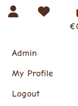

 

No. |Feature Tested | Expected Result | Actual Result | Pass/Fail
----|---------------|-----------------|---------------|----------
3.| Store owner can add new product to the shop | Admin can add products directly from Admin panel | As expected | Pass
 

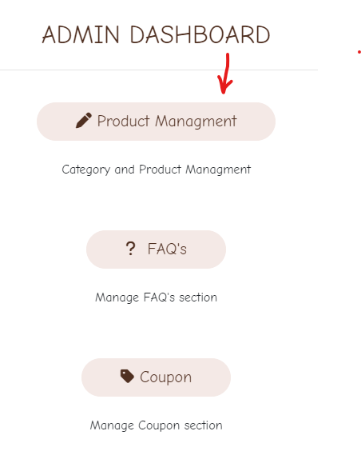
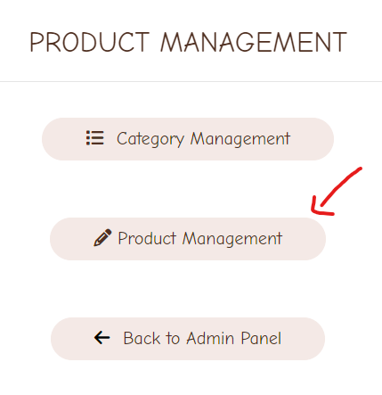
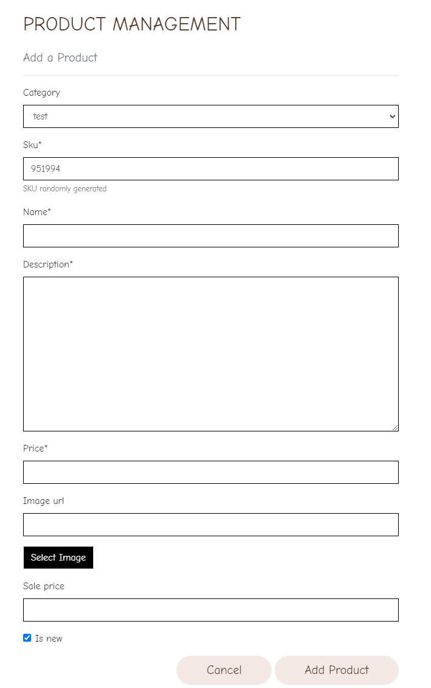

 

No. |Feature Tested | Expected Result | Actual Result | Pass/Fail
----|---------------|-----------------|---------------|----------
4.| Store owner add new categories to the shop | Admin can add categories directly from Admin panel | As expected | Pass
 

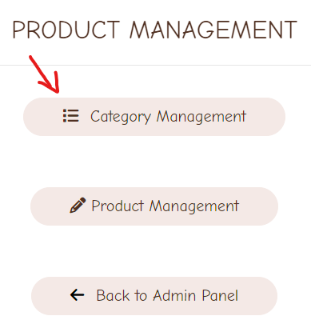
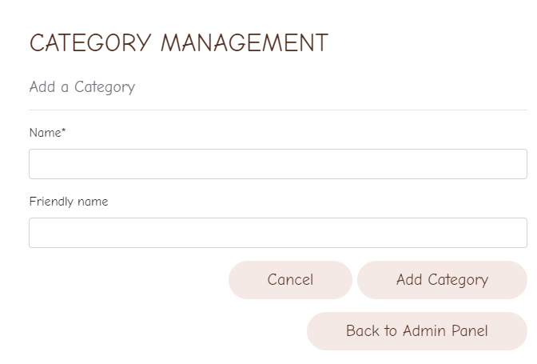

 

No. |Feature Tested | Expected Result | Actual Result | Pass/Fail
----|---------------|-----------------|---------------|----------
5.| Store owner add FAQ's to the site| Admin can add FAQ's directly from Admin panel | As expected | Pass
 

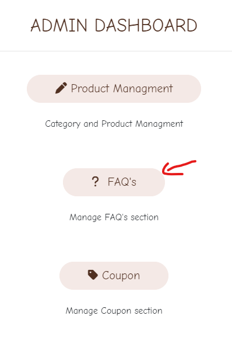
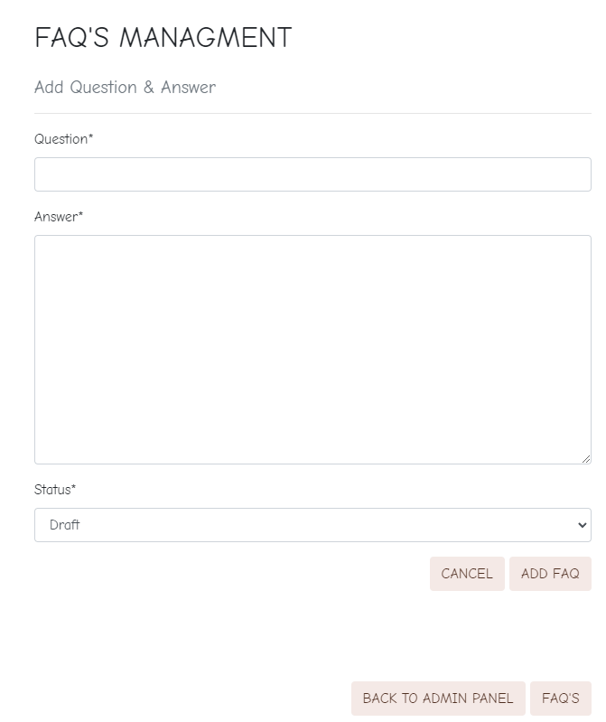

 

No. |Feature Tested | Expected Result | Actual Result | Pass/Fail
----|---------------|-----------------|---------------|----------
6.| Store owner add Coupons to the site| Admin can add Coupons directly from Admin panel | As expected | Pass
 

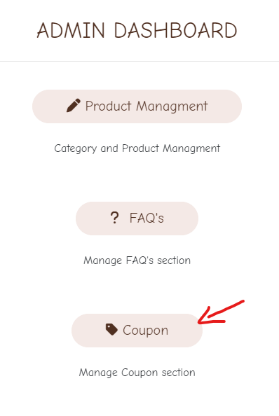
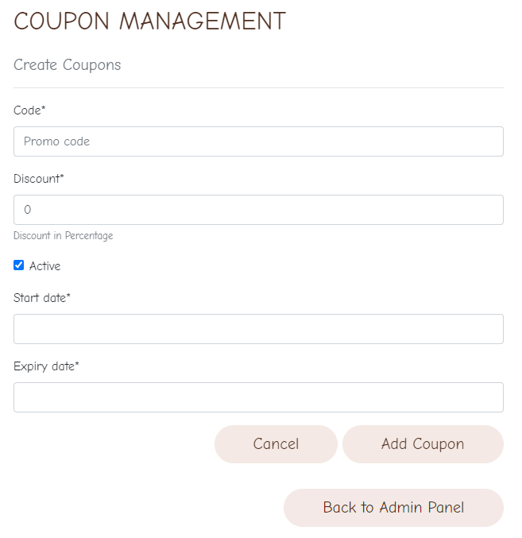

 

No. |Feature Tested | Expected Result | Actual Result | Pass/Fail
----|---------------|-----------------|---------------|----------
7.| Store owner edit products| Admin can edit products from Products page and Product Detail page | As expected | Pass
8.| Store owner delete products| Admin can delete products from Products page and Product Detail page | As expected | Pass

 

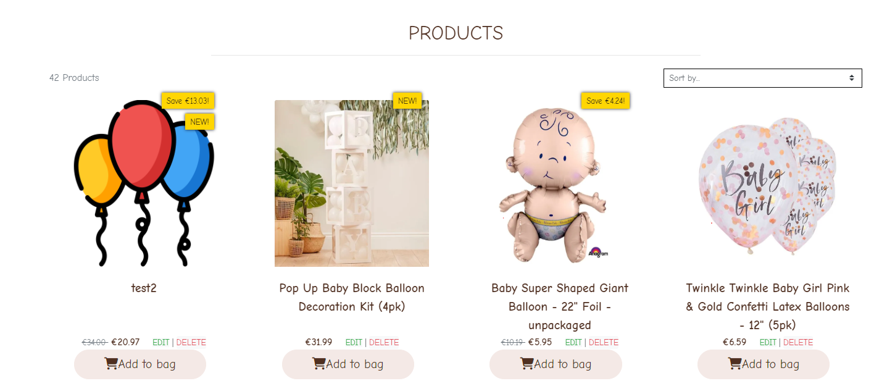
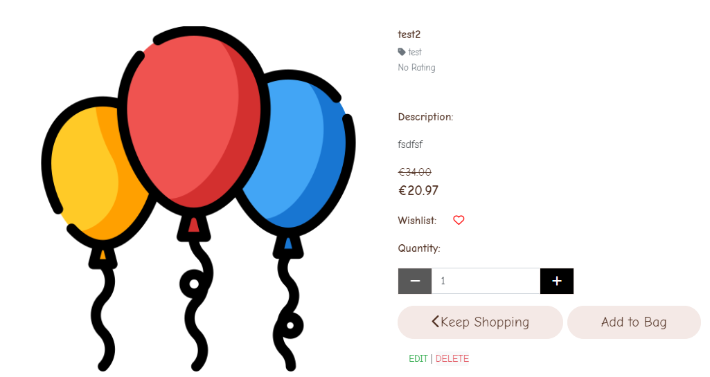
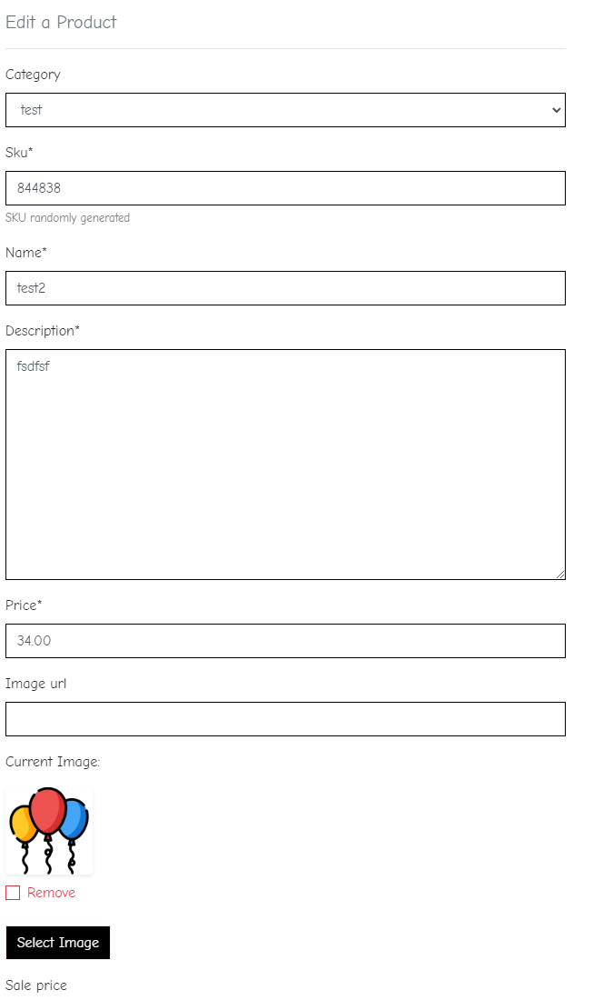

 

No. |Feature Tested | Expected Result | Actual Result | Pass/Fail
----|---------------|-----------------|---------------|----------
9.| Store owner edit categories| Admin can edit categories from admin panel | As expected | Pass
10.| Store owner delete categories| Admin can delete categories from admin panel | As expected | Pass
 

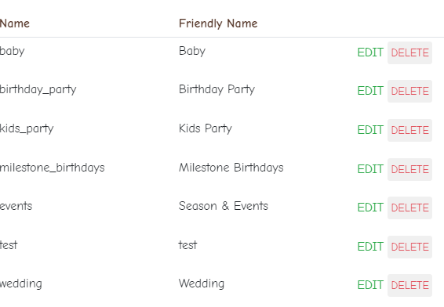
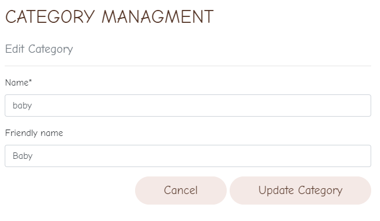

 

No. |Feature Tested | Expected Result | Actual Result | Pass/Fail
----|---------------|-----------------|---------------|----------
11.| Store owner edit Faq's| Admin can edit Faq's from admin panel and Faq's page| As expected | Pass
12.| Store owner delete Faq's| Admin can delete Faq's from admin panel and Faq's page| As expected | Pass
 

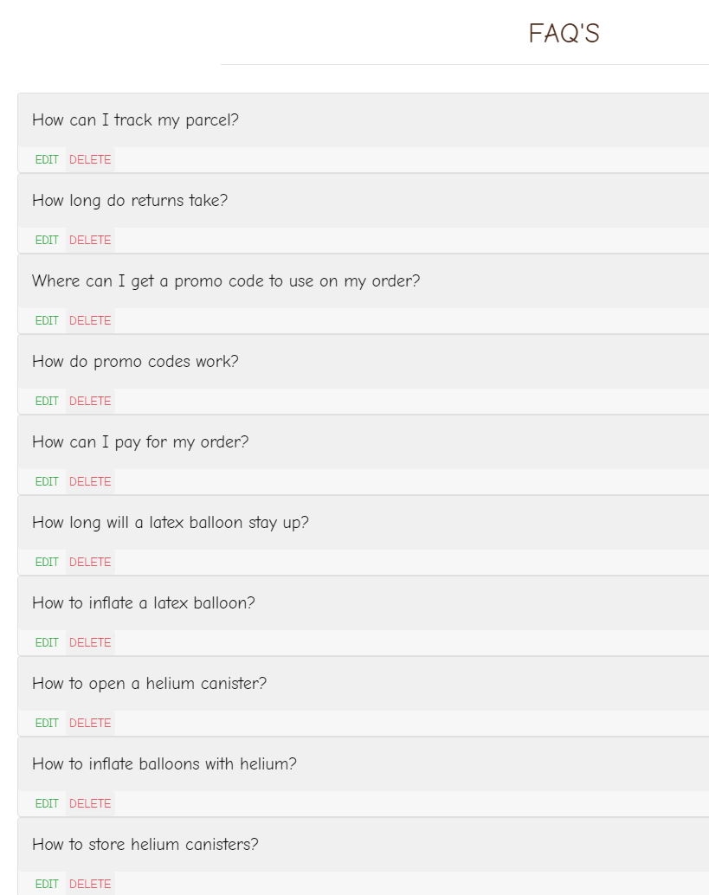
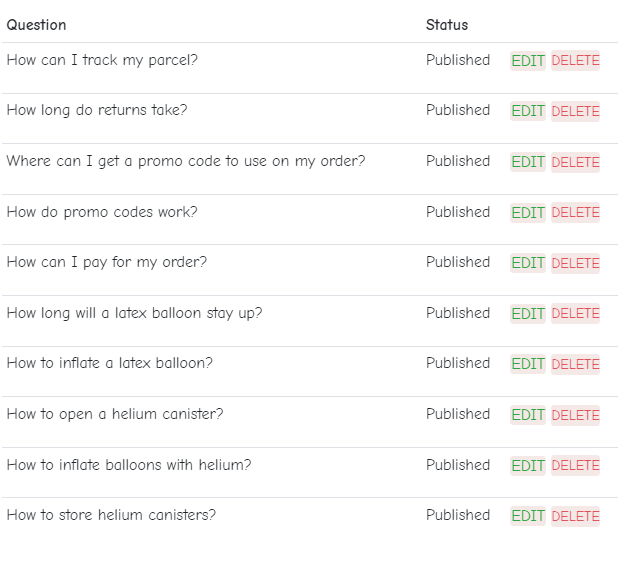
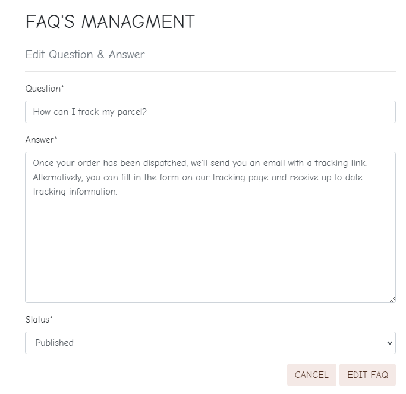
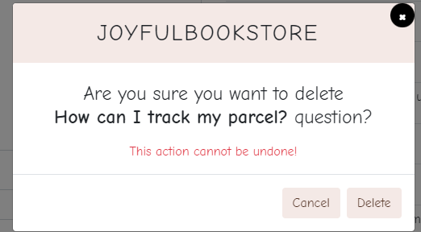

 

No. |Feature Tested | Expected Result | Actual Result | Pass/Fail
----|---------------|-----------------|---------------|----------
13.| Store owner edit Coupons| Admin can edit Coupons from admin panel| As expected | Pass
14.| Store owner delete Coupons| Admin can delete Coupons from admin panel| As expected | Pass
 

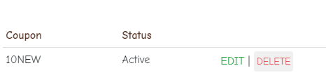
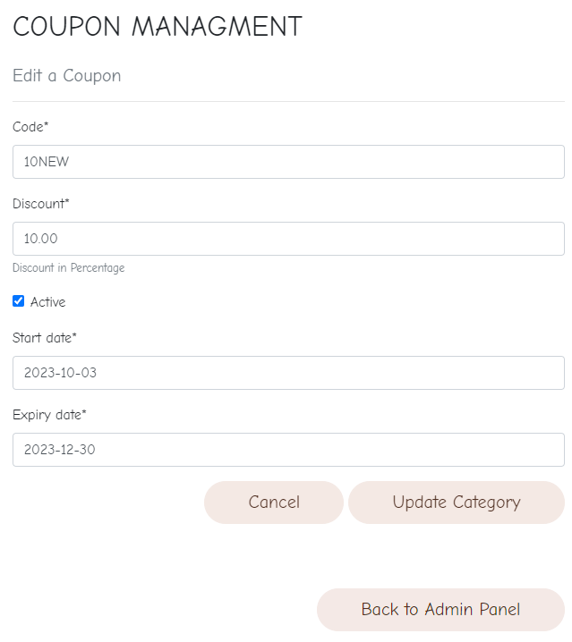
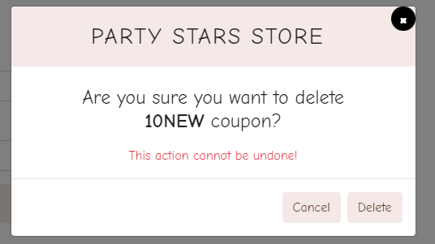

 

No. |Feature Tested | Expected Result | Actual Result | Pass/Fail
----|---------------|-----------------|---------------|----------
15.| Store owner can read/respond to users questions| Admin can read/respond to users questions send by contact form| As expected | Pass
 

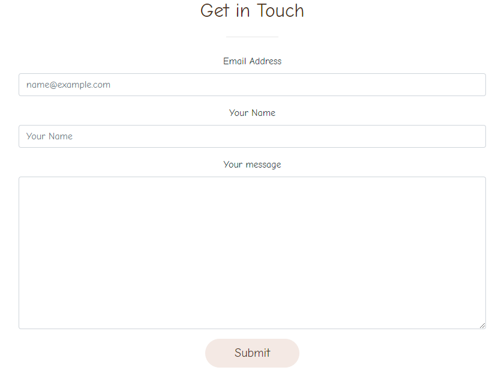
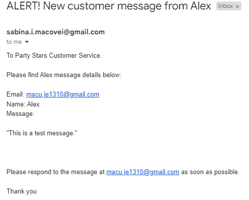
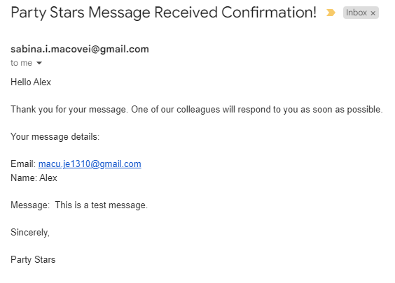

 

## EPIC: Navigation

No. |Feature Tested | Expected Result | Actual Result | Pass/Fail
----|---------------|-----------------|---------------|----------
1.| User can see the purpose of the shop on the landing page | The landing page has a short description that describes the purpose| As expected | Pass
 

 

No. |Feature Tested | Expected Result | Actual Result | Pass/Fail
----|---------------|-----------------|---------------|----------
2.| User can easily navigate to view desired content | Navigation is located on each page so that the user can easily navigate| As expected | Pass
 

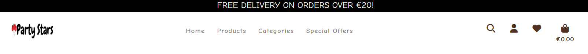

 

No. |Feature Tested | Expected Result | Actual Result | Pass/Fail
----|---------------|-----------------|---------------|----------
3.| User can find a navigation bar and footer | Navigation bar and the footer are on every page and provide the user with a quick link to the desired content| As expected | Pass
 

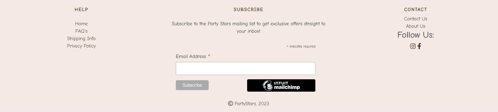

 

No. |Feature Tested | Expected Result | Actual Result | Pass/Fail
----|---------------|-----------------|---------------|----------
4.| User can see the products list | Products list can be find by presing on "Shop Now" button and Products Nav link| As expected | Pass
5.| User can sort the products | User can sort products by price, title, category and rating on the products list page| As expected | Pass
 

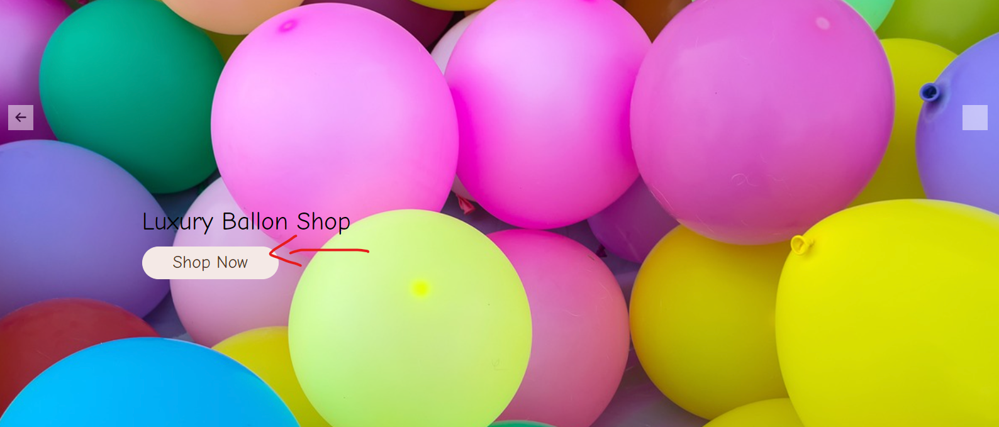
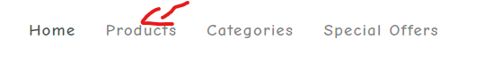
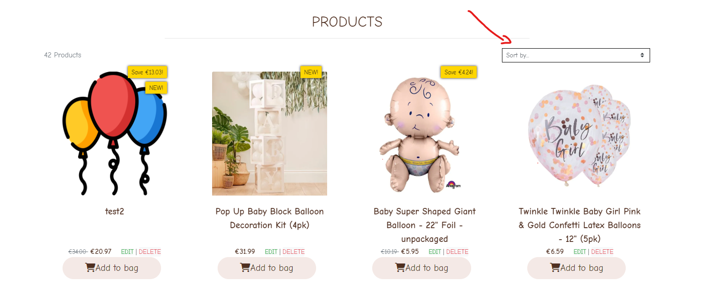
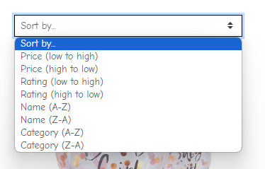

 

No. |Feature Tested | Expected Result | Actual Result | Pass/Fail
----|---------------|-----------------|---------------|----------
6.| User can search products  by category| User can search products by category| As expected | Pass
 

 

No. |Feature Tested | Expected Result | Actual Result | Pass/Fail
----|---------------|-----------------|---------------|----------
7.| User can search products| User can search products by search form, witch will perform a search in the author, title and description fields| As expected | Pass
 

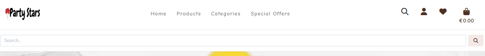

 

No. |Feature Tested | Expected Result | Actual Result | Pass/Fail
----|---------------|-----------------|---------------|----------
8.| User can see the product details| User can see the product name, rating, price and short description in the product details page| As expected | Pass
9.| User can see comments| User can leave a review if they have an account| As expected | Pass
 

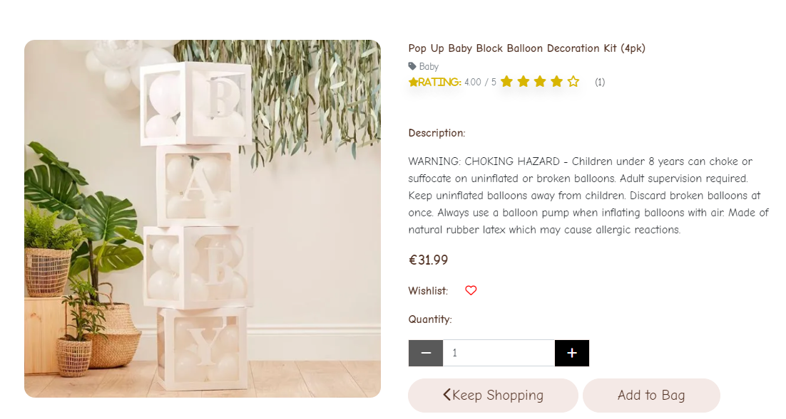
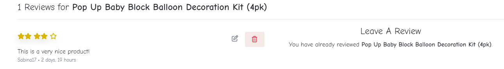
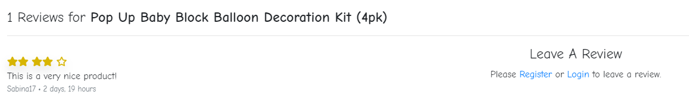

 

No. |Feature Tested | Expected Result | Actual Result | Pass/Fail
----|---------------|-----------------|---------------|----------
10.| User can read the FAQ's| User can read the FAQ's page by accessing the link from the footer| As expected | Pass
 

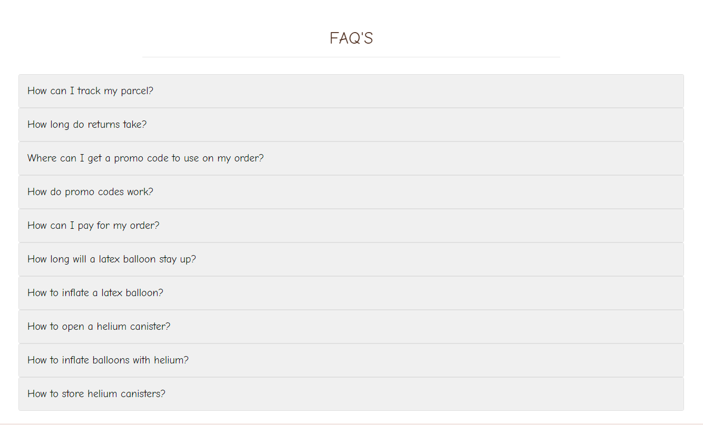

 

## EPIC: Purchase

No. |Feature Tested | Expected Result | Actual Result | Pass/Fail
----|---------------|-----------------|---------------|----------
1.| User can select the quantity of the desired product| User can select quantity of the desired product on Product Detail page and on Shopping Bag page| As expected | Pass
 

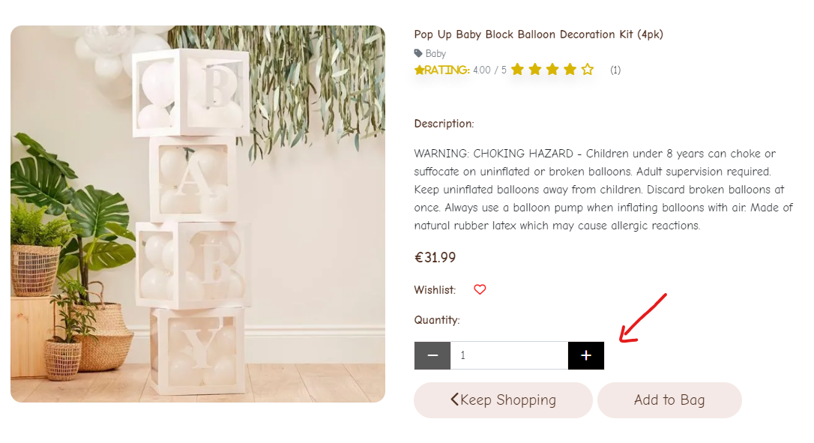
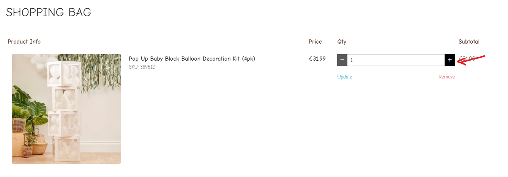

 

No. |Feature Tested | Expected Result | Actual Result | Pass/Fail
----|---------------|-----------------|---------------|----------
2.| User can add a selected product into the shopping bag| User can add selected product into the shopping bag from Products page and from Product Details Page| As expected | Pass
 

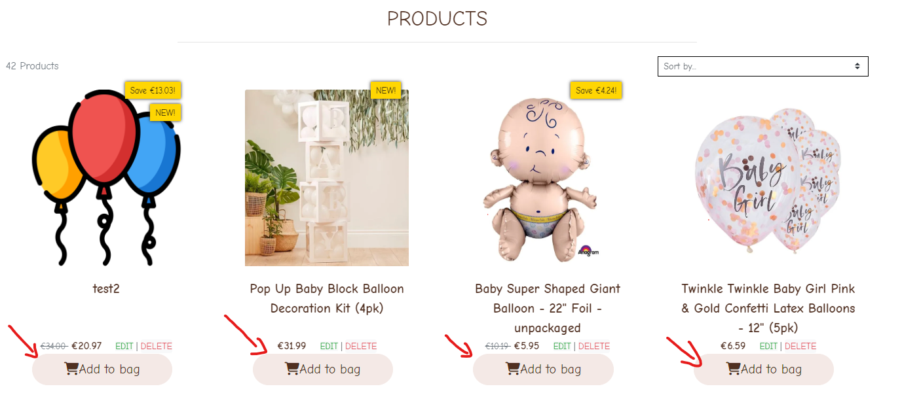
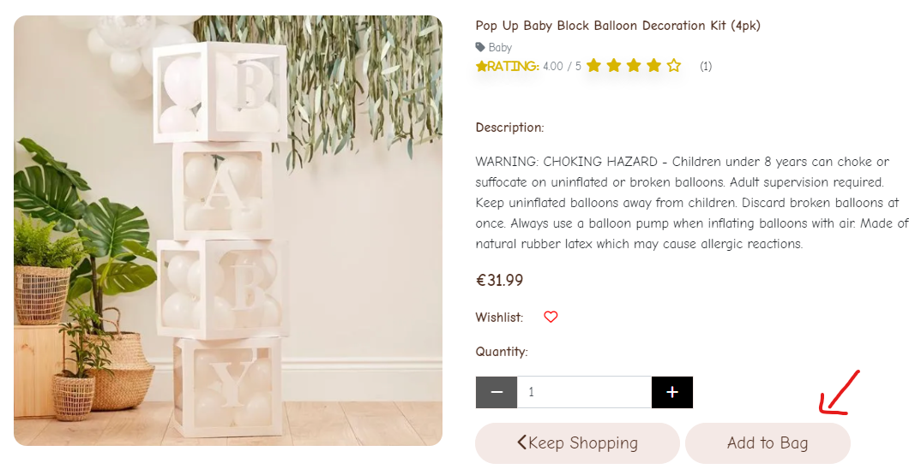

 

No. |Feature Tested | Expected Result | Actual Result | Pass/Fail
----|---------------|-----------------|---------------|----------
3.| User can see the total cost of the shopping bag| Shopping bas is located in navbar and user can always see the total cost| As expected | Pass
 

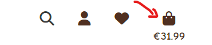

 

No. |Feature Tested | Expected Result | Actual Result | Pass/Fail
----|---------------|-----------------|---------------|----------
4.| User can remove items from shopping bag| User can remove the unwanted items from shopping bag page| As expected | Pass
 

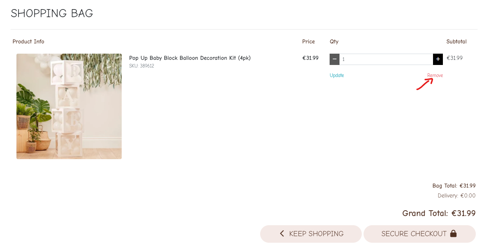

 

No. |Feature Tested | Expected Result | Actual Result | Pass/Fail
----|---------------|-----------------|---------------|----------
5.| User pay for my goods| User can put in card details and delivery details in the checkout page| As expected | Pass
 

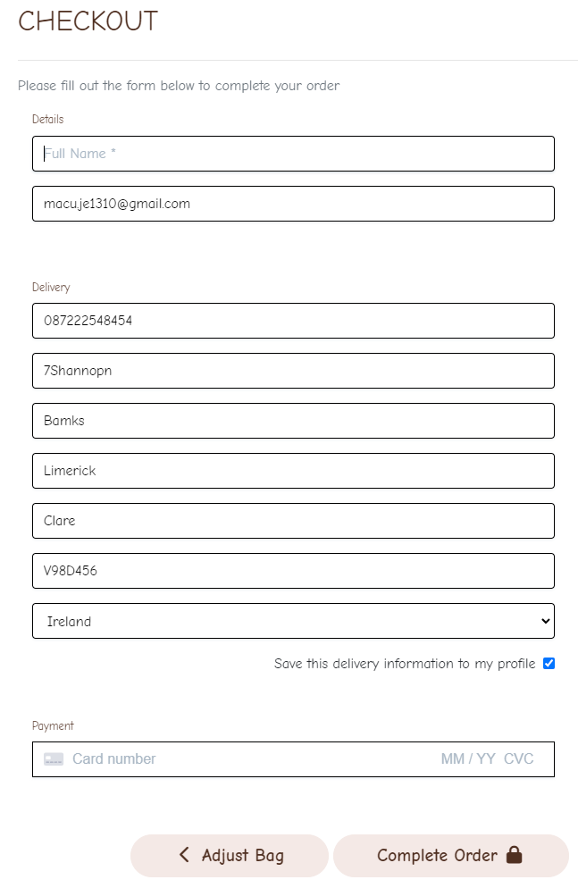

 

No. |Feature Tested | Expected Result | Actual Result | Pass/Fail
----|---------------|-----------------|---------------|----------
6.| User receive order confirmations| After user submitted the purcase they can see order summary and confirmation| As expected | Pass
 

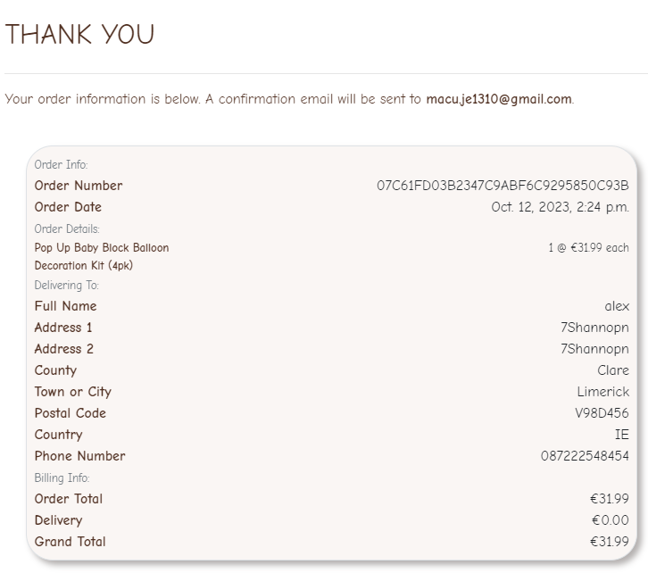

 

## EPIC: User Interaction

No. |Feature Tested | Expected Result | Actual Result | Pass/Fail
----|---------------|-----------------|---------------|----------
1.| User can see rating and reviews| User can see rating and reviews on the Product Details page| As expected | Pass
 

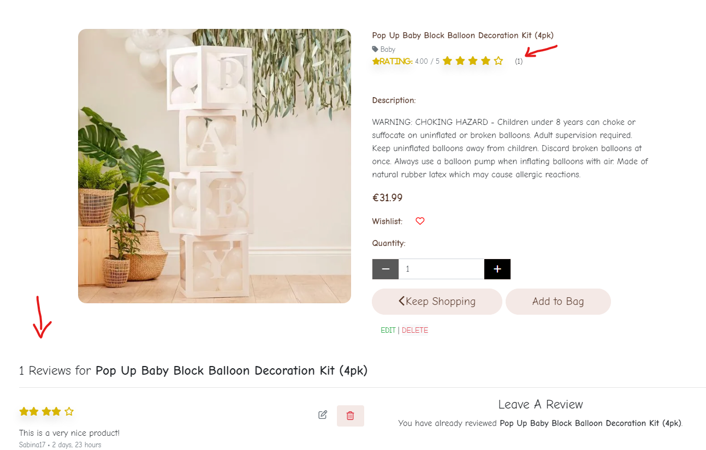

 

No. |Feature Tested | Expected Result | Actual Result | Pass/Fail
----|---------------|-----------------|---------------|----------
2.| User can see/recive notification| Toast messages inform the user of their status and any change the user makes| As expected | Pass
 

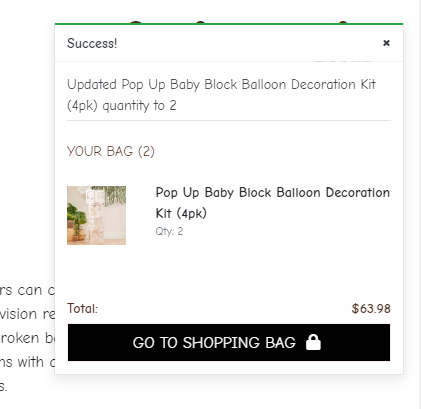

 

No. |Feature Tested | Expected Result | Actual Result | Pass/Fail
----|---------------|-----------------|---------------|----------
3.| User can connect to the social media sites| Social media link are located in the footer of every page so user can easily connect| As expected | Pass
 

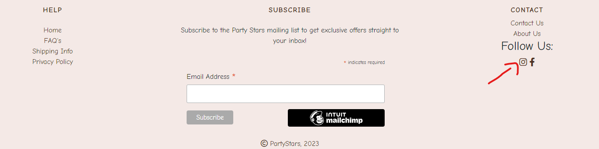

 

No. |Feature Tested | Expected Result | Actual Result | Pass/Fail
----|---------------|-----------------|---------------|----------
4.| User can subscribe for website's newsletter| Footer containes a link for User to subscribe to store newsletter, once subscribe user will receive email confirmation| As expected | Pass
 

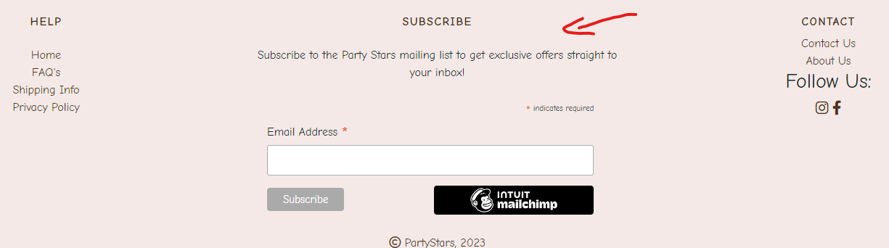
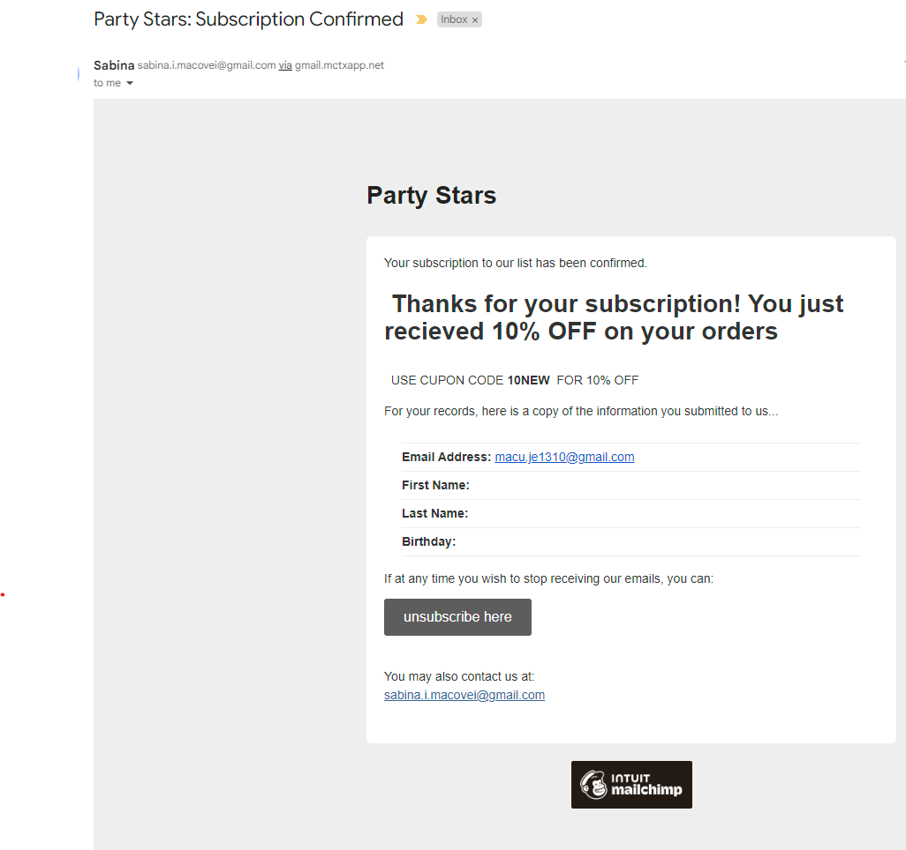

 

No. |Feature Tested | Expected Result | Actual Result | Pass/Fail
----|---------------|-----------------|---------------|----------
5.| User can unsubscribe from newsletter| In every email user can find address to unsubscribe| As expected | Pass
 

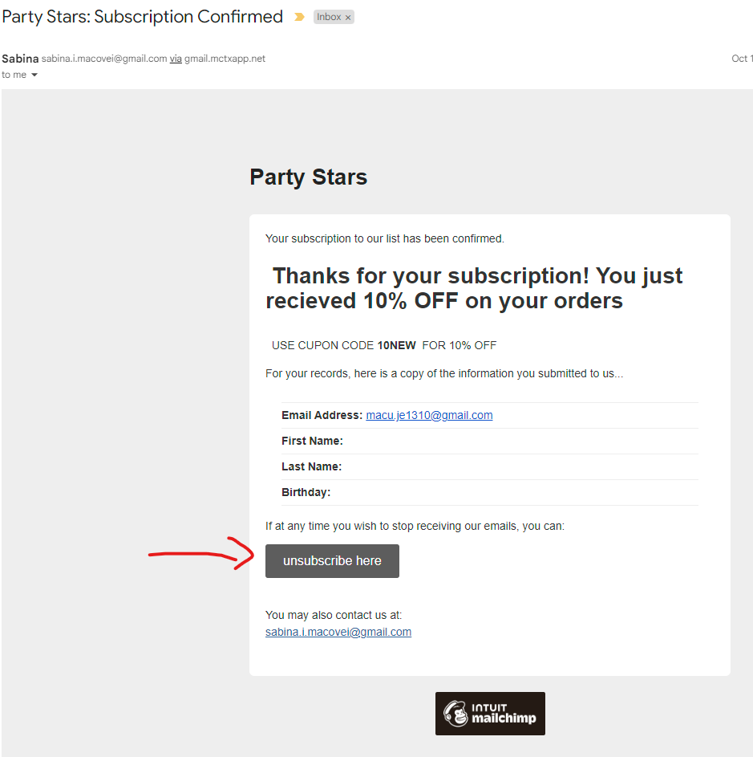

 

No. |Feature Tested | Expected Result | Actual Result | Pass/Fail
----|---------------|-----------------|---------------|----------
6.| User can contact the store| User can contact the store by using the contact form from footer "Contact Us"| As expected | Pass
 

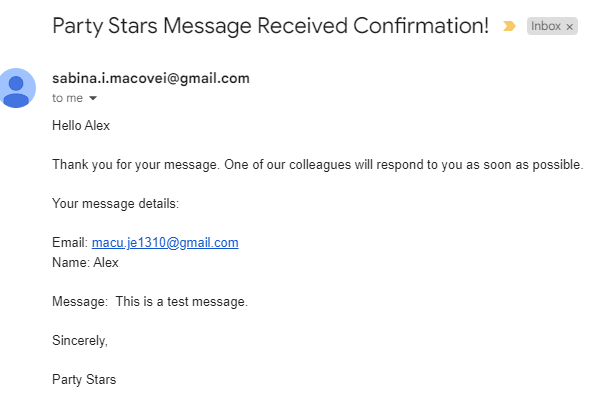

 

No. |Feature Tested | Expected Result | Actual Result | Pass/Fail
----|---------------|-----------------|---------------|----------
7.| Logged-in User I can leave reating and reviews| Logged-in User I can leave reating and reviews on the Product Details page| As expected | Pass
 

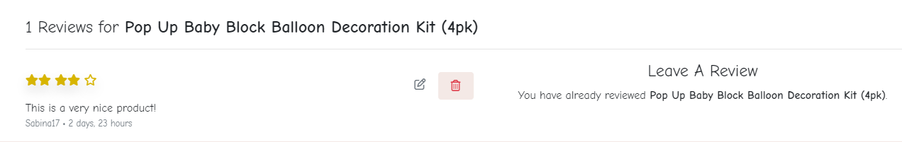

 

No. |Feature Tested | Expected Result | Actual Result | Pass/Fail
----|---------------|-----------------|---------------|----------
8.| Logged-in User I can save selected products to whishlist| Logged-in User can save and remove products to wishlist| As expected | Pass
9.| User that don't have an account can not access "add to wishlist" | For Users that don't have an account and try to use "add to wishlist" a log-in page will be displayed| As expected | Pass
 

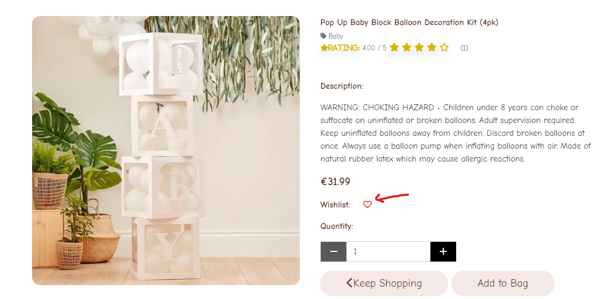
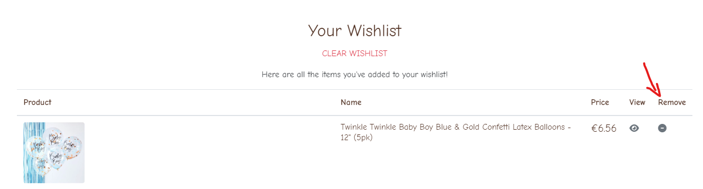
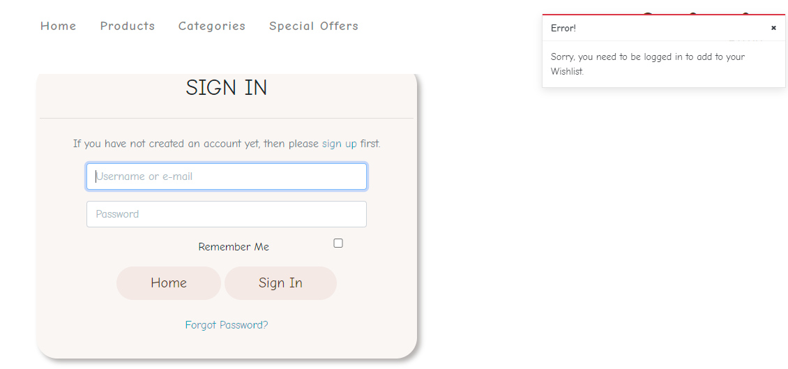

 

## EPIC: Accounts

No. |Feature Tested | Expected Result | Actual Result | Pass/Fail
----|---------------|-----------------|---------------|----------
1.| User can easily see logged-in or logged-out status| User can easily see they account status, when the user is logged in they will see My Profile link| As expected | Pass

 

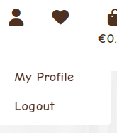

 

No. |Feature Tested | Expected Result | Actual Result | Pass/Fail
----|---------------|-----------------|---------------|----------
2.| User can log in/out| User can easily log-in or log-out from navbar from log-in or log-out link wich will take the user to log-in/log-out page| As expected | Pass

 

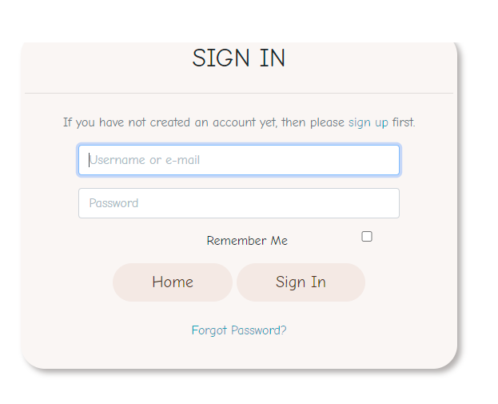
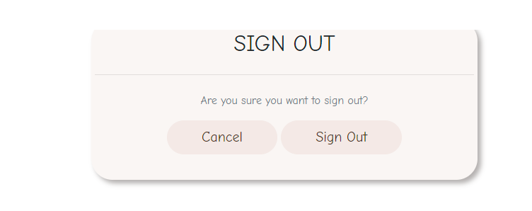

 

No. |Feature Tested | Expected Result | Actual Result | Pass/Fail
----|---------------|-----------------|---------------|----------
3.| User can register for an account| User can easily register from navbar from register link wich will take the user to register page| As expected | Pass

 

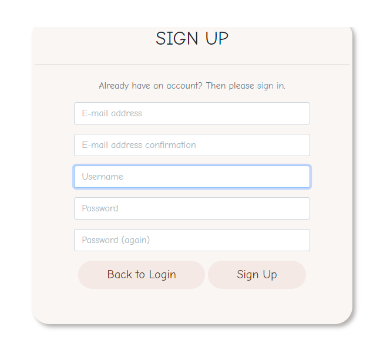

 

No. |Feature Tested | Expected Result | Actual Result | Pass/Fail
----|---------------|-----------------|---------------|----------
4.| User can register for an account| User can easily register from navbar from register link wich will take the user to register page| As expected | Pass

 

 

39. As a user I can receive a confirmation email when creating an account so that I know the registration was successful

40. As a logged-in User I can have my details saved so that I don't have to retype my address every time

