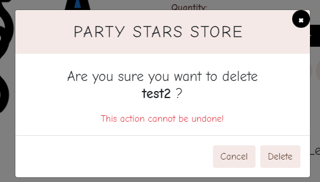
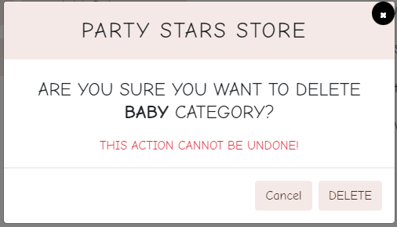
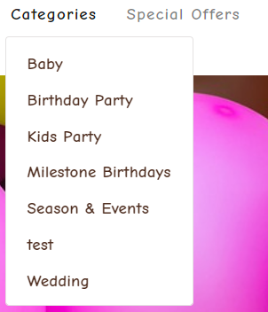

[Validators](#validators)
* [Lighthouse](#lighthouse)
* [HTML](#html)
* [CSS](#css)
* [JSHINT](#jshint)
* [PEP8](#pep8)

[Manual Testing](#manual-testing)

[Responsiveness](#responsiveness)

[Bugs](#bugs)

# Lighthouse 

# HTML

- All Pages were checked with the official [W3C validator](https://validator.w3.org/). 

## Home Page

## Products Page

## Products Detail

## Shopping Bag

## Checkout Page

## User Profile

### Personal Details

### Order History

### Wishlist

## Admin Dashboard

### Category Management

### Add Product

- The only errors that were given were because of the nature of Django Template Syntax.

### FAQ's Management

### Coupons Management

## Contact Us Page

## FAQ's

# CSS

- All CSS was passed through W3C CSS Validation

## Base.css

## Products.css

## Checkout.css

## Profiles.css

# JSHINT 
- All JS was passed through Jshint

## Base

- The Mailchimp script in the base.html page returns errors that cannot be changed due to it belonging to the external API.

## Checkout 

## Shopping Bag

## Products

## Profile

# PEP8
 - PEP8 only shows the type of errors that can be ignored.

 

# Manual Testing

This table shows all the manual testing done for the website, and whether it worked as expected or not.

## User Stories Testing

### EPIC: Store Owner

No. |Feature Tested | Expected Result | Actual Result | Pass/Fail | Visual Result 
----|---------------|-----------------|---------------|-----------|---------------
1.| Store owner can log in/out | Admin can login/out from admin panel | Admin can login/logout from My accout icon wich is situated in the navbar| Pass | 
2.| Store owner can access to store backend | Admin have full access to store backend from admin| When the admin is logged-in he can have acces from Admin link witch is situated in the My account icon | Pass |
3.| Store owner can add new product to the shop | Admin can add products directly from Admin | When the admin is loged-in he can add products from product management situated inside the admin link in the navbar | Pass | 
4.| Store owner add new categories to the shop | Admin can add categories directly from Admin panel | When the admin is loged-in he can add new categories from product management situated inside the admin link in the navbar | Pass | 
5.| Store owner add FAQ's to the site| Admin can add FAQ's directly from Admin panel | When the admin is loged-in he can add new Faq's from Faq situated inside the admin link in the navbar| Pass | 
6.| Store owner add Coupons to the site| Admin can add Coupons directly from Admin panel | When the admin is loged-in he can add new Coupons from Coupon situated inside the admin link in the navbar | Pass | 
7.| Store owner edit products| Admin can edit products from Products page and Product Detail page | When admin is logged in edit button will apear in product detail and product list page | Pass | 
8.| Store owner delete products| Admin can delete products from Products page and Product Detail page | When admin is logged in delete button will apear in product detail and product list page | Pass | 
9.| Store owner edit categories| Admin can edit categories from admin panel | When admin is loged-in he can edit categories from category managment in the admin link | Pass | 
10.| Store owner delete categories| Admin can delete categories from admin panel | When admin is loged-in he can delete categories from category managment in the admin link | Pass | 
11.| Store owner edit Faq's| Admin can edit Faq's from admin panel and Faq's page| When admin is loged-in he can edit Faq's from  Faq's link in the footer or  from the faq managment in the admin link | Pass | 
12.| Store owner delete Faq's| Admin can delete Faq's from admin panel and Faq's page| When admin is loged-in he can delete Faq's from  Faq's link in the footer or  from the faq managment in the admin link | Pass | 
13.| Store owner edit Coupons| Admin can edit Coupons from admin panel| When admin is loged-in he can edit coupons from Coupons managment in the admin link | Pass | 
14.| Store owner delete Coupons| Admin can delete Coupons from admin panel| When admin is loged-in he can delete coupons from Coupons managment in the admin link | Pass | 
15.| Store owner can read/respond to users questions| Admin can read/respond to users questions send by contact form| Admin will be notified be email when the user will submit the contact form completed so that the admin can read and respond to the user | Pass | 

### EPIC: Navigation

No. |Feature Tested | Expected Result | Actual Result | Pass/Fail | Visual Result 
----|---------------|-----------------|---------------|-----------|---------------
1.| User can see the purpose of the shop on the landing page | The landing page has a short description that describes the purpose| On the home page the user can see the purpose of the shop | Pass | 
2.| User can easily navigate to view desired content | Navigation is located on each page so that the user can easily navigate| The navigation bar is present on all pages so that the user can navigate easily | Pass | 
3.| User can find a footer | The footer is on every page and provide the user with a quick link to the desired content| Footer can be found at the bottom of every page | Pass | 
4.| User can see the products list | Products list can be find by clicking on "Shop Now" button and Products Nav link| The product list can be accesed by clicking on the 'Shop Now' button and on the 'Products' link from the navbar | Pass |
5.| User can sort the products | User can sort products by price, title, category and rating on the products list page| On the product list page the user can find the sort bar. They can sort the products by price, title, category and rating  | Pass | 
6.| User can search products  by category| User can search products by category| User can find the categories search in the navbar by clicking on the 'Categories' | Pass | 
7.| User can search products| User can search products by search form, witch will perform a search in the author, title and description fields| The user can search products by clickin on the search icon. The search bar will appear and will perform a search in the author, title and description fields | Pass | 
8.| User can see the product details| User can see the product name, rating, price and short description in the product details page| When clicing on the product the product detail page will open and the user can find the product name, rating, price and short description, quatity bar and add to wishlist| Pass | 
9.| User can see comments| User can leave a review if they have an account| If user is logged in he can leave a comment and rate a product | Pass | 
10.| User can read the FAQ's| User can read the FAQ's page by accessing the link from the footer| When clicking on the Faq's link from the footer the Faq's page opens | Pass | 

### EPIC: Purchase

No. |Feature Tested | Expected Result | Actual Result | Pass/Fail | Visual Result 
----|---------------|-----------------|---------------|-----------|---------------
1.| User can select the quantity of the desired product| User can select quantity of the desired product on Product Detail page and on Shopping Bag page| Quantity bar is pressent on the 'Product Detail' page and on the 'Shopping Bag page' | Pass |
2.| User can add a selected product into the shopping bag| User can add selected product into the shopping bag from Products page and from Product Details Page| The 'Add to bag' button is pressent on the 'Products' list page and on the 'Product Detail' page | Pass |
3.| User can see the total cost of the shopping bag| Shopping bas is located in navbar and user can always see the total cost| User can easily see the total of his bag  on the top right iun the navbar where the shooping bag icon is showing the total cost | Pass | 
4.| User can remove items from shopping bag| User can remove the unwanted items from shopping bag page| User can find the remove item button in the shopping bag page  | Pass | 
5.| User can pay for their goods| User can put in card details and delivery details in the checkout page| User can add the payment detail and delivery details in the form from checkout page  | Pass | 
6.| User receive order confirmations| After user submitted the purcase they can see order summary and confirmation| User can see the a summary of their order and a order cofirmation after tehy have completted and submited the checkout page | Pass | 

### EPIC: User Interaction

No. |Feature Tested | Expected Result | Actual Result | Pass/Fail | Visual Result 
----|---------------|-----------------|---------------|-----------|---------------
1.| User can see rating and reviews| User can see rating and reviews on the Product Details page| User can see products ratings and reviews on the 'Product Detail' page | Pass | 
2.| User can see/recive notification| Toast messages inform the user of their status and any change the user makes| When the user is making any changes, he will be notified in the top right corner by a toast message regarding his changes | Pass | 
3.| User can connect to the social media sites| Social media link are located in the footer of every page so user can easily connect| The social media links are located in the footer | Pass | 
4.| User can subscribe for website's newsletter| Footer containes a link for User to subscribe to store newsletter, once subscribe user will receive email confirmation| In the footer, the user can find a mailchimp embeded form where they can subscribe for the newsletters | Pass | 
5.| User can unsubscribe from newsletter| In every email user can find address to unsubscribe| In the Subscription confirmation email the user can find a button to unsubscribe | Pass | 
6.| User can contact the store| User can contact the store by using the contact form from footer "Contact Us"| The 'Contact Us' link , from the footer, is opening the concat form where the user can add their informations | Pass | 
7.| Logged-in User I can leave reating and reviews| Logged-in User I can leave reating and reviews on the Product Details page| The add review and rating form will appear on the Product detail page is the user is logged-in, if not a log-in/register message will be displayed | Pass | 
8.| Logged-in User I can save selected products to whishlist| Logged-in User can save and remove products to wishlist| User can add products to the wishlist from the 'Product Detail' Page and cand remove them from the Wishlist page by clicking the minus icon | Pass |
9.| User that don't have an account can not access "add to wishlist" | For Users that don't have an account and try to use "add to wishlist" a log-in page will be displayed| Wishlist is not available for user that are not logged-in or they dont have an account | Pass

### EPIC: Accounts

No. |Feature Tested | Expected Result | Actual Result | Pass/Fail | Visual Result 
----|---------------|-----------------|---------------|-----------|---------------
1.| User can easily see logged-in or logged-out status| User can easily see they account status, when the user is logged in they will see My Profile link| User can see the their status by clicking on the my account icon | Pass | 
2.| User can log in/out| User can easily log-in or log-out from navbar from log-in or log-out link wich will take the user to log-in/log-out page| The log-in and log-out links will take the user to the desiered page | Pass |
3.| User can register for an account| User can easily register from navbar from register link wich will take the user to register page| The registration button can be found in the my account dropdown. Resistarion link will take te user on the registartion page where he have to complete all the fields | Pass | 
4.| User can receive a confirmation email when creating an account| User will recive a notification message then they have to check their email address| After the registration form is submited the user will recive a confirmation email where he will find a link to confirm his account  | Pass | 
5.| Logged-in User can have my details saved| Logged-in User can see their details saved in Personal details fron navbar| In the My profile link from the my acount icon, the user can find the Personal details where he can save his delivery informations | Pass | 

