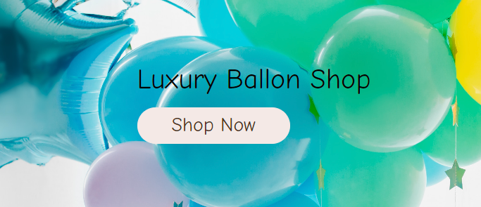

# User Stories Testing

## EPIC: Store Owner

No. |Feature Tested | Expected Result | Actual Result | Pass/Fail
----|---------------|-----------------|---------------|----------
1.| Store owner can log in/out | Admin can login/out from admin panel | As expected | Pass
2.| Store owner can access to store backend | Admin have full access to store backend from admin panel | As expected | Pass
 

 

No. |Feature Tested | Expected Result | Actual Result | Pass/Fail
----|---------------|-----------------|---------------|----------
3.| Store owner can add new product to the shop | Admin can add products directly from Admin panel | As expected | Pass
 

 

No. |Feature Tested | Expected Result | Actual Result | Pass/Fail
----|---------------|-----------------|---------------|----------
4.| Store owner add new categories to the shop | Admin can add categories directly from Admin panel | As expected | Pass
 

 

No. |Feature Tested | Expected Result | Actual Result | Pass/Fail
----|---------------|-----------------|---------------|----------
5.| Store owner add FAQ's to the site| Admin can add FAQ's directly from Admin panel | As expected | Pass
 

 

No. |Feature Tested | Expected Result | Actual Result | Pass/Fail
----|---------------|-----------------|---------------|----------
6.| Store owner add Coupons to the site| Admin can add Coupons directly from Admin panel | As expected | Pass
 

 

No. |Feature Tested | Expected Result | Actual Result | Pass/Fail
----|---------------|-----------------|---------------|----------
7.| Store owner edit products| Admin can edit products from Products page and Product Detail page | As expected | Pass
8.| Store owner delete products| Admin can delete products from Products page and Product Detail page | As expected | Pass

 

 

No. |Feature Tested | Expected Result | Actual Result | Pass/Fail
----|---------------|-----------------|---------------|----------
9.| Store owner edit categories| Admin can edit categories from admin panel | As expected | Pass
10.| Store owner delete categories| Admin can delete categories from admin panel | As expected | Pass
 

 

No. |Feature Tested | Expected Result | Actual Result | Pass/Fail
----|---------------|-----------------|---------------|----------
11.| Store owner edit Faq's| Admin can edit Faq's from admin panel and Faq's page| As expected | Pass
12.| Store owner delete Faq's| Admin can delete Faq's from admin panel and Faq's page| As expected | Pass
 

 

No. |Feature Tested | Expected Result | Actual Result | Pass/Fail
----|---------------|-----------------|---------------|----------
13.| Store owner edit Coupons| Admin can edit Coupons from admin panel| As expected | Pass
14.| Store owner delete Coupons| Admin can delete Coupons from admin panel| As expected | Pass
 

 

No. |Feature Tested | Expected Result | Actual Result | Pass/Fail
----|---------------|-----------------|---------------|----------
15.| Store owner can read/respond to users questions| Admin can read/respond to users questions send by contact form| As expected | Pass
 

 

## EPIC: Navigation

No. |Feature Tested | Expected Result | Actual Result | Pass/Fail
----|---------------|-----------------|---------------|----------
1.| User can see the purpose of the shop on the landing page | The landing page has a short description that describes the purpose| As expected | Pass
 

 

No. |Feature Tested | Expected Result | Actual Result | Pass/Fail
----|---------------|-----------------|---------------|----------
2.| User can easily navigate to view desired content | Navigation is located on each page so that the user can easily navigate| As expected | Pass
 

 

No. |Feature Tested | Expected Result | Actual Result | Pass/Fail
----|---------------|-----------------|---------------|----------
3.| User can find a navigation bar and footer | Navigation bar and the footer are on every page and provide the user with a quick link to the desired content| As expected | Pass
 

 

No. |Feature Tested | Expected Result | Actual Result | Pass/Fail
----|---------------|-----------------|---------------|----------
4.| User can see the products list | Products list can be find by presing on "Shop Now" button and Products Nav link| As expected | Pass
5.| User can sort the products | User can sort products by price, title, category and rating on the products list page| As expected | Pass
 

 

16. As a user I can search products by category so that I can easily find what I'm looking for
    - User can search books by category and easily sort books by desired book type

17. As a user I can sort products by rating, price and name so that I can easily find what I'm looking for
    - User can sort products by price,rating,title and category on All Books page

18. As a user I can search for products using the search form so that I can find the products I'm specifically looking for
    - User can use search bar to search for specific product, search form will perform a search in the author, title and description fields

 

19. As a user I can see the book details page so that I can see the book name, rating, price, short description and comments
    - The user can see the book details and leave a review if they have an account

 

20. As a user I can read the FAQ's so that I can find the answer to my question or concern before contacting the bookstore
    - The user can read the FAQ's page before contacting the bookstore and check if his question has already been answered

## EPIC: Purchase

21. As a user I can select the quantity of the desired product so that I can buy more product of the same kind
    - User can select quantity of the desired product on Book Detail page and on Shopping Bag page

22. As a user I can add a selected book into the shopping bag so that I can keep track of what I am spending
    - User can add selected book into the shopping bag from All Books page and from Book Details Page

23. As a user I can see the shopping bag summary and total cost so that I can see how much I will spend
    - Shopping bas is located in navbar and user can always see shopping bag summary

24. As a user I can remove items from shopping bag so that I don't buy what I don't want
    - User can remove the unwanted items from the shopping bag

25. As a user I can put in my card details so that I can pay for my goods
     - User can put in card details and delivery details so that they can make a purchase

26. As a user I receive order confirmations so that I can be sure my order has been processed
    - After user submitted the purcase they can see order summary and confirmation

## EPIC: User Interaction

27. As a user I can see rating and reviews so that I can read the opinions of other users

 

 

28. As a user I am notified about any changes I have made so that I have a clear understanding of what has been completed/updated
    -  Toast messages inform the user of their status and any change the user makes

29. As a user I can connect to the social media sites so that I can follow them and keep up to date with their products and promotions
    - Social media link are located in the footer of every page so user can easily connect

30. As a user I can sign up for the website's newsletter so that I can keep up to date with new products and promotions
    - Footer containes a link for User to subscribe to bookstore newsletter, once subscribe user will receive email confirmation  

31. As a user I can unsubscribe from newsletter if I don't want to receive stors newsletters
    - In every email user can find address to unsubscribe

32. As a user I can contact the bookstore so that I can find out any information that I require

33. As a user I can receive a contact confirmation email to let me know that my email has been sent

34. As a logged-in User I can leave reating and reviews so that I can share my experience with others

35. As a logged-in User I can save selected products to my whishlist for later purchase
    - Logged-in User can save and remove products to wishlist. 
    - For Users that don't have an account and try to use "add to wishlist" button a pop window will tell users to open an account to uset this feature 

## EPIC: Accounts

36. As a user I can easily see if I'm logged-in or logged-out so that I can be sure what my status is
    - User can easily see they account status, when the user is logged in they will see My Account link

37. As a user I can log in/out off my account if I wish so that I can connect or disconnect from the website

38. As a user I can register for an account so that I can use features for logged-in users

39. As a user I can receive a confirmation email when creating an account so that I know the registration was successful

40. As a logged-in User I can have my details saved so that I don't have to retype my address every time

